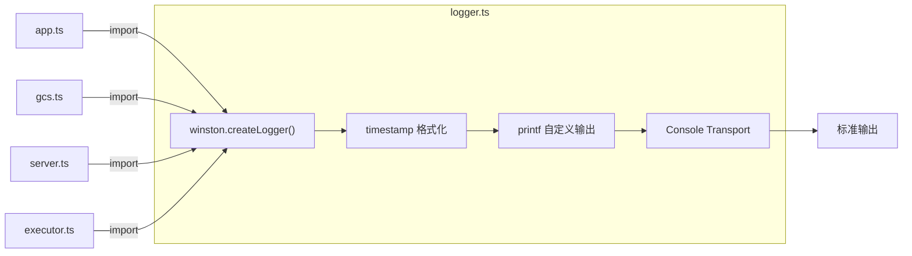

# logger.ts

> 基于 Winston 的全局日志记录器，提供带时间戳的格式化控制台输出。

## 概述

`logger.ts` 创建并导出一个预配置的 Winston 日志记录器实例，作为 `a2a-server` 包内所有模块的统一日志工具。日志输出到控制台，格式为 `[LEVEL] YYYY-MM-DD HH:mm:ss.SSS A -- message`，附加字段以 JSON 格式换行输出。

该文件在模块中扮演"基础设施"角色，几乎被所有其他模块导入使用。

## 架构图



## 主要导出

### `logger: winston.Logger`

预配置的 Winston 日志记录器实例，配置如下：

| 配置项 | 值 | 说明 |
|---|---|---|
| `level` | `'info'` | 最低日志级别 |
| `format` | `timestamp` + `printf` | 组合格式化器 |
| `transports` | `Console` | 输出到控制台 |

支持的日志方法（继承自 Winston）：
- `logger.error(message, ...meta)`
- `logger.warn(message, ...meta)`
- `logger.info(message, ...meta)`
- `logger.debug(message, ...meta)`

## 核心逻辑

### 日志格式

使用 `winston.format.combine` 组合两个格式化器：

1. **`timestamp`** -- 为每条日志添加 `YYYY-MM-DD HH:mm:ss.SSS A` 格式的时间戳（如 `2025-01-15 02:30:45.123 PM`）。
2. **`printf`** -- 自定义输出格式：
   ```
   [LEVEL] 2025-01-15 02:30:45.123 PM -- 日志消息
   ```
   如果日志对象中包含 `level`、`timestamp`、`message` 之外的额外字段（如 `...rest`），则以 JSON 格式缩进 2 空格追加输出。

### 输出示例

```
[INFO] 2025-01-15 02:30:45.123 PM -- [CoreAgent] Agent Server started on http://localhost:41242
[ERROR] 2025-01-15 02:30:46.456 PM -- Failed to save task abc-123 to GCS:
{
  "stack": "Error: ...",
  "code": "STORAGE_ERROR"
}
```

## 内部依赖

无。

## 外部依赖

| npm 包 | 用途 |
|---|---|
| `winston` | 日志框架，提供 Logger 类、格式化器和 Transport 机制 |
