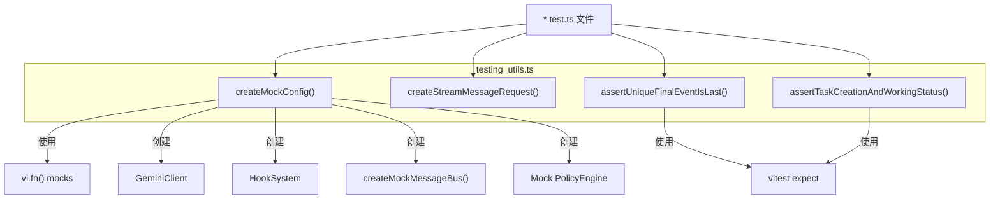

# testing_utils.ts

> 测试辅助工具集，提供模拟 Config 对象、构造流式消息请求和断言事件序列的工具函数。

## 概述

`testing_utils.ts` 为 `a2a-server` 包的单元测试和集成测试提供三类工具：

1. **`createMockConfig`** -- 创建一个全面模拟的 `Config` 对象，包含所有必要的 getter 和 mock 方法，可通过 `overrides` 参数自定义。
2. **`createStreamMessageRequest`** -- 构造符合 A2A 协议的 `message/stream` JSON-RPC 请求体。
3. **`assertUniqueFinalEventIsLast` / `assertTaskCreationAndWorkingStatus`** -- 断言流式事件序列是否符合预期的 A2A 协议规范。

该文件在模块中扮演"测试基础设施"角色，被各测试文件广泛导入。

## 架构图



## 主要导出

### `createMockConfig(overrides?: Partial<Config>): Partial<Config>`

创建一个完整的模拟 `Config` 对象，用于测试中替代真实配置。

**参数：**

| 参数 | 类型 | 说明 |
|---|---|---|
| `overrides` | `Partial<Config>` | 可选，覆盖默认 mock 值 |

**返回值：** 包含以下预配置 mock 的 `Partial<Config>` 对象：

| 属性/方法 | 默认值 |
|---|---|
| `getToolRegistry()` | 返回空工具注册表 mock |
| `getApprovalMode()` | `ApprovalMode.DEFAULT` |
| `getIdeMode()` | `false` |
| `isInteractive()` | `true` |
| `getTargetDir()` | 系统临时目录 |
| `getCheckpointingEnabled()` | `false` |
| `getActiveModel()` | `DEFAULT_GEMINI_MODEL` |
| `getModel()` | `'gemini-pro'` |
| `getMessageBus()` | `createMockMessageBus()` |
| `getHookSystem()` | `new HookSystem(mockConfig)` |
| `getGeminiClient()` | `new GeminiClient(mockConfig)` |
| `getPolicyEngine()` | YOLO 模式返回 ALLOW，否则 ASK_USER |
| `getShellExecutionConfig()` | `NoopSandboxManager` + 空净化配置 |

此外还包含 `config`、`toolRegistry`、`messageBus`、`geminiClient` 等 getter 属性，可直接读取对应的模拟对象。

---

### `createStreamMessageRequest(text: string, messageId: string, taskId?: string)`

构造一个 A2A 协议的 `message/stream` JSON-RPC 2.0 请求对象。

**参数：**

| 参数 | 类型 | 说明 |
|---|---|---|
| `text` | `string` | 用户消息文本 |
| `messageId` | `string` | 消息 ID |
| `taskId` | `string?` | 可选任务 ID，传入时附加到 `params` |

**返回值结构：**

```typescript
{
  jsonrpc: '2.0',
  id: '1',
  method: 'message/stream',
  params: {
    message: { kind: 'message', role: 'user', parts: [{ kind: 'text', text }], messageId },
    metadata: { coderAgent: { kind: 'agent-settings', workspacePath: '/tmp' } },
    taskId?,  // 仅在传入时包含
  }
}
```

---

### `assertUniqueFinalEventIsLast(events: SendStreamingMessageSuccessResponse[]): void`

断言事件序列满足以下条件：

1. 最后一个事件的 `status.state` 为 `'input-required'`。
2. 最后一个事件的 `final` 为 `true`。
3. 最后一个事件的 `metadata.coderAgent` 包含 `{ kind: 'state-change' }`。
4. 整个序列中 `final === true` 的事件恰好只有一个，且位于最后位置。

---

### `assertTaskCreationAndWorkingStatus(events: SendStreamingMessageSuccessResponse[]): void`

断言事件序列的前两个事件符合标准的任务创建流程：

1. `events[0]` -- 类型为 `task`，状态为 `'submitted'`。
2. `events[1]` -- 类型为 `status-update`，状态为 `'working'`。

## 核心逻辑

### Mock Config 的设计模式

`createMockConfig` 使用了几个值得注意的技巧：

1. **Getter 属性** -- `config`、`toolRegistry`、`messageBus`、`geminiClient` 通过 `get` 定义，内部将 `this` 强制转换为 `Config` 类型，实现自引用。
2. **延迟初始化** -- `getMessageBus`、`getHookSystem`、`getGeminiClient`、`getPolicyEngine` 在对象创建后单独赋值，因为它们依赖 `mockConfig` 自身。
3. **覆盖机制** -- 使用扩展运算符 `...overrides` 允许测试用例覆盖任意默认值。
4. **策略引擎逻辑** -- `getPolicyEngine` 返回的 mock 会根据 `getApprovalMode()` 的当前值动态决定返回 `ALLOW` 还是 `ASK_USER`。

## 内部依赖

无直接的同包内部模块依赖。

## 外部依赖

| npm 包 | 用途 |
|---|---|
| `node:path` | 路径拼接 |
| `@a2a-js/sdk` | `Task`、`TaskStatusUpdateEvent`、`SendStreamingMessageSuccessResponse` 类型 |
| `@google/gemini-cli-core` | `ApprovalMode`、`DEFAULT_GEMINI_MODEL`、`GeminiClient`、`HookSystem`、`PolicyDecision`、`tmpdir`、`Config`、`Storage`、`NoopSandboxManager`、`ToolRegistry` 等核心类型和类 |
| `@google/gemini-cli-core/src/test-utils/mock-message-bus.js` | `createMockMessageBus` -- 消息总线 mock |
| `vitest` | `expect`、`vi` -- 测试框架断言和 mock 工具 |
