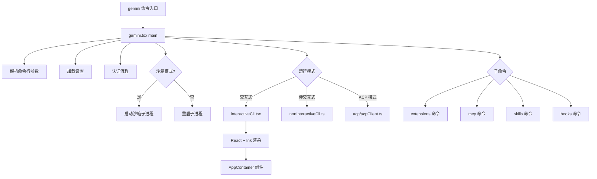

# packages/cli 架构

> Gemini CLI 的命令行界面入口包，提供交互式和非交互式两种模式，支持 ACP 协议集成 IDE。

## 概述

`@google/gemini-cli` 是 Gemini CLI 项目的主包，它是用户与 Gemini AI 交互的终端入口。该包负责：

1. **命令行参数解析**：通过 yargs 解析用户输入的各种参数和子命令
2. **交互式 UI 渲染**：基于 React + Ink 框架在终端中渲染丰富的交互界面
3. **非交互式执行**：支持通过管道或 `--prompt` 参数直接执行 AI 任务
4. **ACP 协议支持**：实现 Agent Client Protocol，供 IDE 插件（如 VS Code）集成
5. **子命令管理**：提供 extensions、mcp、skills、hooks 等管理子命令
6. **沙箱执行**：支持在隔离沙箱环境中运行以增强安全性

该包作为 CLI 可执行文件入口（`gemini` 命令），依赖 `@google/gemini-cli-core` 提供核心功能。

## 架构图



## 目录结构

```
packages/cli/
├── package.json              # 包配置，定义依赖和 bin 入口
├── src/                      # 源代码目录
│   ├── gemini.tsx            # 主入口，main() 函数
│   ├── interactiveCli.tsx    # 交互式 UI 启动
│   ├── nonInteractiveCli.ts  # 非交互式执行
│   ├── acp/                  # Agent Client Protocol 实现
│   ├── commands/             # CLI 子命令（extensions, mcp, skills, hooks）
│   ├── config/               # 配置加载与管理
│   ├── core/                 # 核心初始化逻辑
│   ├── patches/              # 依赖补丁
│   ├── services/             # 斜杠命令服务
│   ├── ui/                   # React/Ink UI 组件
│   └── utils/                # 工具函数
├── examples/                 # 演示示例
└── dist/                     # 编译输出
```

## 关键文件

| 文件 | 功能 |
|------|------|
| `package.json` | 包定义，bin 入口为 `dist/index.js`，声明 70+ 依赖 |
| `src/gemini.tsx` | 主入口函数 `main()`，协调启动流程：设置加载、认证、沙箱、UI 渲染 |
| `src/interactiveCli.tsx` | 交互式 UI 启动，构建 React 上下文树并通过 Ink 渲染到终端 |
| `src/nonInteractiveCli.ts` | 非交互式模式执行，处理管道输入和 `--prompt` 参数 |
| `src/deferred.ts` | 延迟命令加载机制，优化启动性能 |
| `src/validateNonInterActiveAuth.ts` | 非交互式模式的认证验证 |

## 内部依赖

- `src/acp/` - ACP 协议实现，用于 IDE 集成
- `src/commands/` - 所有 CLI 子命令的实现
- `src/config/` - 配置加载、设置管理、扩展管理
- `src/core/` - 应用初始化和认证
- `src/services/` - 斜杠命令发现与加载
- `src/ui/` - 全部 React/Ink UI 组件
- `src/utils/` - 工具函数集

## 外部依赖

| 依赖 | 用途 |
|------|------|
| `@google/gemini-cli-core` | 核心功能库（workspace 包） |
| `@google/genai` | Google GenAI SDK |
| `@agentclientprotocol/sdk` | ACP 协议 SDK |
| `@modelcontextprotocol/sdk` | MCP 协议 SDK |
| `ink` (via `@jrichman/ink`) | 终端 React 渲染框架 |
| `react` | UI 组件框架 |
| `yargs` | 命令行参数解析 |
| `chalk` | 终端颜色输出 |
| `zod` | 运行时类型验证 |
| `simple-git` | Git 操作 |
| `ws` | WebSocket 客户端 |
| `dotenv` | 环境变量加载 |
