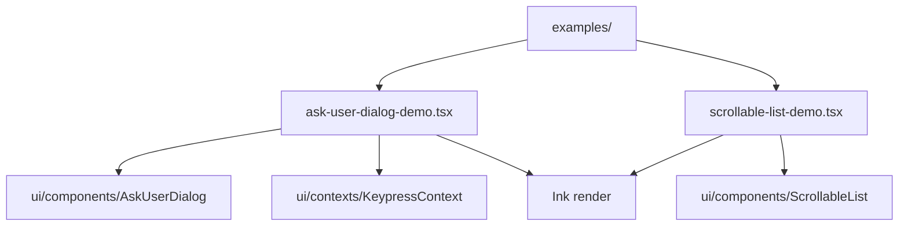

# examples 架构

> CLI 包的 UI 组件演示示例，用于开发和测试交互式组件。

## 概述

`examples/` 目录包含独立可运行的 React/Ink 组件演示，用于在开发过程中单独测试和展示特定的 UI 组件。这些示例不是 CLI 的正式功能，而是开发者工具，可以通过 `npx tsx examples/<demo>.tsx` 单独运行。

## 架构图



## 目录结构

```
examples/
├── ask-user-dialog-demo.tsx      # AskUserDialog 组件演示
└── scrollable-list-demo.tsx      # ScrollableList 组件演示
```

## 关键文件

| 文件 | 功能 |
|------|------|
| `ask-user-dialog-demo.tsx` | 演示 `AskUserDialog` 组件的各种交互模式：单选列表（项目类型选择）、多选列表（功能特性选择）、文本输入（项目名称输入）。定义了多个演示问题，包裹在 `KeypressProvider` 上下文中，使用 Ink `render()` 直接渲染 |
| `scrollable-list-demo.tsx` | 演示 `ScrollableList` 组件的滚动行为和交互 |

## 内部依赖

- `../src/ui/components/AskUserDialog.tsx` - AskUserDialog 组件
- `../src/ui/contexts/KeypressContext.tsx` - 按键事件上下文
- `../src/ui/components/` - 其他被演示的 UI 组件

## 外部依赖

| 依赖 | 用途 |
|------|------|
| `react` | React 框架 |
| `ink` | 终端 UI 渲染 |
| `@google/gemini-cli-core` | QuestionType 等类型 |
