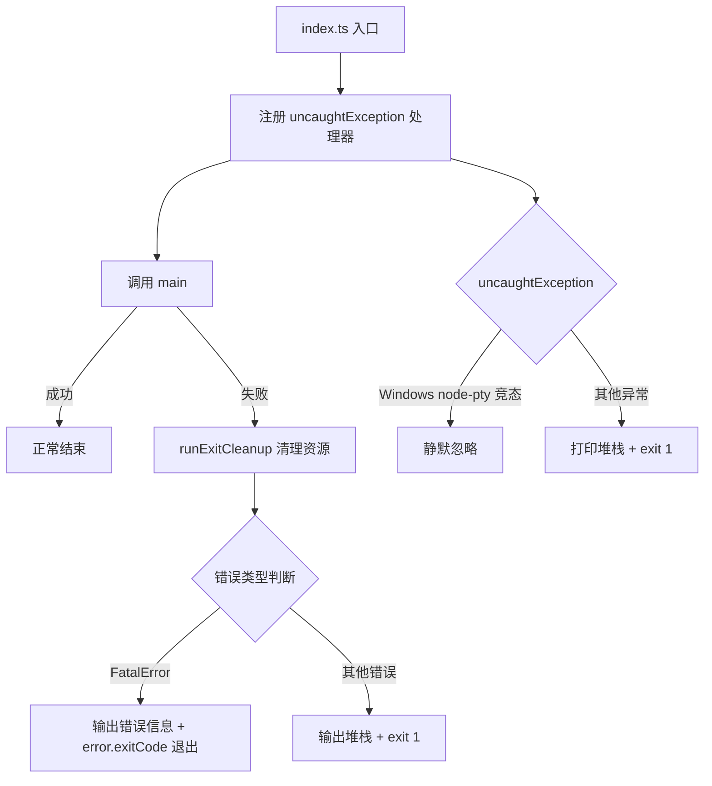

# index.ts

> CLI 应用程序的全局入口点，负责启动主流程、处理未捕获异常和优雅退出。

## 概述

`index.ts` 是 Gemini CLI 的 shebang 入口文件（`#!/usr/bin/env -S node --no-warnings=DEP0040`）。它完成以下三件事：

1. 注册全局 `uncaughtException` 处理器，静默 Windows 平台上 `node-pty` 的已知竞态条件错误，其余异常打印堆栈后以退出码 1 终止进程。
2. 调用 `main()` 启动应用程序主逻辑。
3. 在 `main()` 抛出异常时，先执行清理（`runExitCleanup`），再根据错误类型（`FatalError` 或其他）输出错误信息并以相应退出码退出。

## 架构图（mermaid）

## 主要导出

此文件为入口脚本，不导出任何符号。

## 核心逻辑

| 逻辑块 | 说明 |
|---|---|
| `process.on('uncaughtException', ...)` | 全局异常兜底。在 Windows 上过滤 `Cannot resize a pty that has already exited` 错误（node-pty 已知 bug #827），其余错误输出后退出。 |
| `main().catch(...)` | 主函数异常捕获。先启动 5 秒超时保护，调用 `runExitCleanup()` 执行清理；若清理本身失败则输出清理错误；最后根据 `FatalError` 与否决定退出码。支持 `NO_COLOR` 环境变量控制是否显示红色错误文本。 |

## 内部依赖

| 模块 | 用途 |
|---|---|
| `./src/gemini.js` | 提供 `main()` 函数，应用程序主逻辑 |
| `./src/utils/cleanup.js` | 提供 `runExitCleanup()` 函数，执行退出前资源清理 |

## 外部依赖

| 模块 | 用途 |
|---|---|
| `@google/gemini-cli-core` | 提供 `FatalError` 错误类和 `writeToStderr` 工具函数 |
