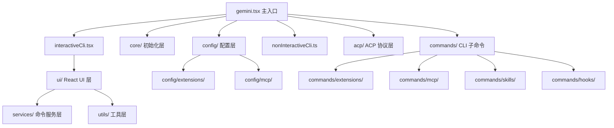

# src 架构

> CLI 包的源代码根目录，组织了从启动入口到 UI 渲染的完整应用逻辑。

## 概述

`src/` 是 `@google/gemini-cli` 包的源代码目录，包含了 CLI 应用的全部实现。它以 `gemini.tsx` 为入口，根据运行模式分支为交互式 UI、非交互式命令行、或 ACP 协议通信三种路径。代码按功能分为多个子目录，遵循关注点分离原则。

## 架构图



## 目录结构

```
src/
├── gemini.tsx                     # 主入口，main() 函数
├── interactiveCli.tsx             # 交互式 UI 启动与 React 渲染
├── nonInteractiveCli.ts           # 非交互式模式执行
├── nonInteractiveCliCommands.ts   # 非交互式模式命令处理
├── deferred.ts                    # 延迟命令加载（优化启动性能）
├── validateNonInterActiveAuth.ts  # 非交互式认证验证
├── acp/                           # Agent Client Protocol 实现
├── commands/                      # CLI 子命令（gemini extensions/mcp/skills/hooks）
├── config/                        # 配置加载与管理
├── core/                          # 应用初始化
├── patches/                       # 依赖补丁
├── services/                      # 斜杠命令服务
├── ui/                            # React/Ink UI 组件（单独文档）
├── utils/                         # 工具函数
├── test-utils/                    # 测试辅助工具
└── integration-tests/             # 集成测试
```

## 关键文件

| 文件 | 功能 |
|------|------|
| `gemini.tsx` | 应用主入口：加载设置、解析参数、认证、沙箱判断、启动 UI 或非交互式模式 |
| `interactiveCli.tsx` | 构建 React Provider 树（Settings、Keypress、Mouse、Terminal、Scroll 等上下文），通过 Ink render 渲染 AppContainer |
| `nonInteractiveCli.ts` | 处理非交互式输入（管道/prompt 参数），直接调用 GeminiChat 并输出到 stdout |
| `nonInteractiveCliCommands.ts` | 非交互式模式下的命令匹配和处理 |
| `deferred.ts` | 延迟加载子命令模块，避免在主启动路径中加载不必要的代码 |
| `validateNonInterActiveAuth.ts` | 非交互式模式下验证认证类型和凭据 |

## 内部依赖

各子目录之间的依赖关系：
- `gemini.tsx` 依赖 `config/`、`core/`、`acp/`、`utils/`
- `interactiveCli.tsx` 依赖 `ui/`、`config/`、`utils/`
- `commands/` 依赖 `config/`、`utils/`
- `services/` 依赖 `ui/commands/`（SlashCommand 类型）
- `ui/` 依赖 `services/`、`config/`、`utils/`

## 外部依赖

| 依赖 | 用途 |
|------|------|
| `@google/gemini-cli-core` | 核心功能：Config、Auth、Tools、GeminiChat 等 |
| `react` + `ink` | 交互式终端 UI 框架 |
| `yargs` | CLI 参数解析和子命令路由 |
