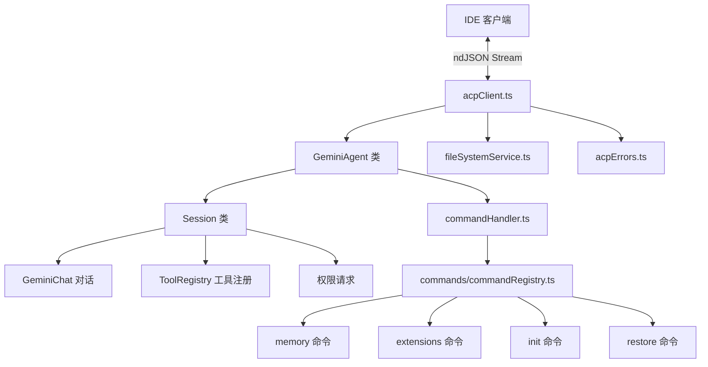

# acp 架构

> 实现 Agent Client Protocol (ACP)，使 Gemini CLI 能够作为 IDE 插件后端以无头模式运行。

## 概述

`acp/` 目录实现了 Agent Client Protocol，这是一种标准化的代理-客户端通信协议。当 Gemini CLI 以 ACP 模式运行时（通常由 IDE 插件如 VS Code 扩展启动），它不渲染终端 UI，而是通过 ndJSON 流与 IDE 进行双向通信。ACP 模块管理会话生命周期、认证流程、工具调用、权限请求等核心交互。

## 架构图



## 目录结构

```
acp/
├── acpClient.ts          # ACP 入口，GeminiAgent 和 Session 类
├── acpErrors.ts          # ACP 错误消息提取
├── commandHandler.ts     # 斜杠命令处理器
├── fileSystemService.ts  # ACP 文件系统服务代理
└── commands/             # ACP 模式下的命令实现
```

## 关键文件

| 文件 | 功能 |
|------|------|
| `acpClient.ts` | 核心文件。`runAcpClient()` 启动 ndJSON 流通信；`GeminiAgent` 类处理 initialize、authenticate、newSession、loadSession、prompt 等 ACP 请求；`Session` 类管理单个会话的对话、工具调用和流式响应 |
| `commandHandler.ts` | `CommandHandler` 类，解析和执行斜杠命令（如 `/memory`、`/extensions`、`/init`、`/restore`） |
| `acpErrors.ts` | `getAcpErrorMessage()` 函数，递归解析 Google API 错误 JSON，提取人类可读的错误消息 |
| `fileSystemService.ts` | `AcpFileSystemService` 类，实现 `FileSystemService` 接口，将文件读写请求委托给 ACP 客户端（IDE 端），支持 fallback 到本地文件系统 |

## 内部依赖

- `commands/` - ACP 斜杠命令实现（memory、extensions、init、restore）
- `../config/config.ts` - CLI 配置加载
- `../config/settings.ts` - 设置管理
- `../utils/cleanup.ts` - 清理和退出处理
- `../utils/sessionUtils.ts` - 会话选择器

## 外部依赖

| 依赖 | 用途 |
|------|------|
| `@agentclientprotocol/sdk` | ACP 协议 SDK，提供 `AgentSideConnection`、请求/响应类型 |
| `@google/gemini-cli-core` | Config、GeminiChat、ToolRegistry、AuthType 等核心类型 |
| `@google/genai` | Content、Part、FunctionCall 等 GenAI 类型 |
| `zod` | 运行时类型验证（AuthType 枚举验证、gateway schema 验证） |
