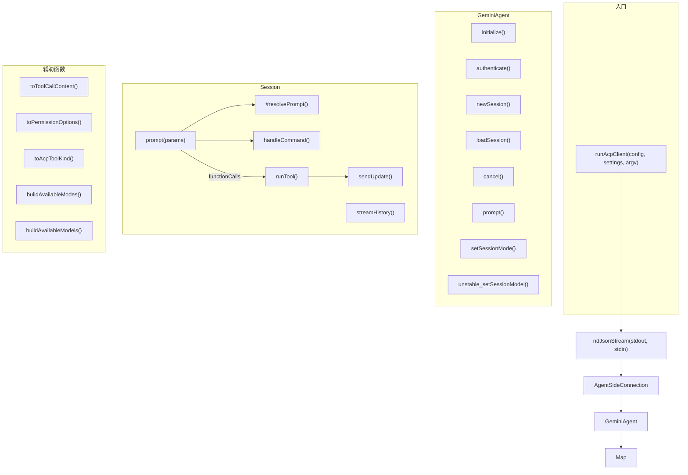

# acpClient.ts

> ACP（Agent Client Protocol）客户端核心实现，是 Gemini CLI 以无头代理模式运行的完整入口，包含连接管理、会话生命周期、提示处理、工具调用和模型/模式管理。

## 概述

`acpClient.ts` 是 Gemini CLI ACP 子系统中最核心也最庞大的文件（约 1677 行），实现了 Gemini CLI 作为 ACP 兼容代理（Agent）与 IDE 客户端（如 VS Code、Zed 等）之间的完整通信协议。

文件包含以下主要组成部分：

1. **`runAcpClient` 函数** — 全局入口，建立 stdin/stdout 上的 ndJSON 双向流连接。
2. **`GeminiAgent` 类** — ACP 代理层，管理多会话、认证、MCP 服务器配置。
3. **`Session` 类** — 单个对话会话的完整生命周期，包括提示处理、流式响应、工具调用、斜杠命令拦截。
4. **辅助函数** — 工具结果转换、权限选项构建、工具类型映射、模式/模型列表构建等。

## 架构图（mermaid）



## 主要导出

| 导出项 | 类型 | 说明 |
|--------|------|------|
| `runAcpClient(config, settings, argv)` | 异步函数 | ACP 客户端全局入口，建立连接并等待关闭 |
| `GeminiAgent` | 类 | ACP 代理实现，处理初始化、认证和多会话管理 |
| `Session` | 类 | 单个对话会话管理，处理提示、工具调用和流式输出 |

## 核心逻辑

---

### 1. `runAcpClient(config, settings, argv)` — 全局入口

```typescript
export async function runAcpClient(config, settings, argv)
```

**功能**: 启动 ACP 代理进程。

**流程**:
1. 调用 `createWorkingStdio()` 获取工作用 stdout（避免与调试输出冲突）。
2. 将 `process.stdin` 和工作 stdout 包装为 Web Stream。
3. 通过 `acp.ndJsonStream(stdout, stdin)` 创建 ndJSON 双向流。
4. 创建 `AgentSideConnection`，传入工厂函数 `(conn) => new GeminiAgent(config, settings, argv, conn)`。
5. 等待 `connection.closed`，使用 `.finally(runExitCleanup)` 确保退出时执行清理（刷新遥测等）。

---

### 2. `GeminiAgent` 类 — 代理层

管理多个 `Session` 实例和全局认证状态。

#### 成员变量

| 变量 | 类型 | 说明 |
|------|------|------|
| `sessions` | `Map<string, Session>` | 会话 ID 到 Session 实例的映射 |
| `clientCapabilities` | `acp.ClientCapabilities` | 客户端能力声明（含文件系统等） |
| `apiKey` | `string` | 缓存的 API Key |
| `baseUrl` | `string` | 自定义网关 Base URL |
| `customHeaders` | `Record<string, string>` | 自定义网关请求头 |

#### `initialize(args: InitializeRequest): Promise<InitializeResponse>`

ACP 握手阶段，返回代理的能力声明：

- **认证方法**: 支持 4 种 — Google 登录、Gemini API Key、Vertex AI、自定义网关。
- **代理信息**: 名称 `gemini-cli`、版本号。
- **代理能力**: 支持加载会话、图片/音频/嵌入式上下文提示、HTTP/SSE MCP 服务器。

认证方法的 `_meta` 中包含客户端渲染提示信息（如 API Key 的 provider、网关协议等）。

#### `authenticate(req: AuthenticateRequest): Promise<void>`

处理认证请求：

1. 解析 `methodId` 为 `AuthType` 枚举值（通过 Zod）。
2. 若切换了认证方式，清除之前缓存的凭据文件。
3. 从 `_meta` 中提取 API Key（若有）。
4. 从 `_meta.gateway` 中提取网关 `baseUrl` 和 `headers`（若有），使用 Zod schema 校验。
5. 调用 `config.refreshAuth(method, apiKey, baseUrl, headers)` 执行认证。
6. 将选择的认证类型持久化到用户设置。

#### `newSession({ cwd, mcpServers }): Promise<NewSessionResponse>`

创建新会话的完整流程：

1. 生成随机 UUID 作为 `sessionId`。
2. 加载工作目录对应的 settings。
3. 调用 `newSessionConfig` 创建配置（合并 MCP 服务器）。
4. 执行认证，额外验证 Gemini API Key 场景下 key 是否存在。
5. 若客户端支持文件系统代理，创建 `AcpFileSystemService` 并设置。
6. 初始化配置，刷新启动性能分析。
7. 创建 Gemini 聊天实例，创建 `Session` 对象。
8. 异步发送可用斜杠命令列表。
9. 构建可用模型和模式列表返回。

#### `loadSession({ sessionId, cwd, mcpServers }): Promise<LoadSessionResponse>`

恢复已有会话：

1. 调用 `initializeSessionConfig` 创建并认证配置。
2. 使用 `SessionSelector` 解析会话数据。
3. 设置文件系统服务（若支持）。
4. 将会话历史转换为客户端格式，调用 `geminiClient.resumeChat` 恢复聊天上下文。
5. 创建 `Session` 对象，流式推送历史消息。
6. 返回模式/模型信息。

#### `newSessionConfig(sessionId, cwd, mcpServers, loadedSettings?): Promise<Config>`

创建会话级配置：

1. 合并设置中已有的 MCP 服务器配置。
2. 遍历客户端传入的 `mcpServers`：
   - **HTTP/SSE 类型**: 提取 headers，创建 `MCPServerConfig`。
   - **Stdio 类型**: 提取环境变量，创建 `MCPServerConfig`。
3. 调用 `loadCliConfig(settings, sessionId, argv, { cwd })` 构建完整配置。

#### `initializeSessionConfig(sessionId, cwd, mcpServers): Promise<Config>` (private)

安全初始化流程（用于 `loadSession`）：

1. 先创建配置但**不初始化**（不启动 MCP 服务器）。
2. **先认证**再初始化 — 安全要求：必须先验证用户身份再执行可能不安全的 MCP 服务器定义。
3. 认证通过后再 `config.initialize()` 启动 MCP 服务器等重资源。

#### 其他方法

- `cancel(params)`: 获取 Session 并调用 `cancelPendingPrompt()`。
- `prompt(params)`: 委托给对应 Session 的 `prompt()` 方法。
- `setSessionMode(params)`: 委托给 Session 的 `setMode()`。
- `unstable_setSessionModel(params)`: 委托给 Session 的 `setModel()`。

---

### 3. `Session` 类 — 会话管理

管理单个对话会话的完整生命周期。

#### 成员变量

| 变量 | 类型 | 说明 |
|------|------|------|
| `id` | `string` | 会话 ID |
| `chat` | `GeminiChat` | Gemini 聊天实例 |
| `config` | `Config` | 会话级配置 |
| `connection` | `AgentSideConnection` | ACP 连接 |
| `settings` | `LoadedSettings` | 加载的设置 |
| `pendingPrompt` | `AbortController \| null` | 当前进行中的提示的中止控制器 |
| `commandHandler` | `CommandHandler` | 斜杠命令处理器 |

#### `cancelPendingPrompt(): Promise<void>`

中止当前正在进行的提示，调用 `pendingPrompt.abort()`。

#### `setMode(modeId): SetSessionModeResponse`

验证模式 ID 有效性，调用 `config.setApprovalMode()` 设置审批模式（Default / Auto Edit / YOLO / Plan）。

#### `setModel(modelId): SetSessionModelResponse`

调用 `config.setModel(modelId)` 切换模型。

#### `sendAvailableCommands(): Promise<void>`

通过 `sessionUpdate: 'available_commands_update'` 向客户端推送可用斜杠命令列表。

#### `streamHistory(messages): Promise<void>`

将对话历史流式推送给客户端：

- **用户消息**: 发送 `user_message_chunk`。
- **Gemini 消息**:
  - 思考内容: 发送 `agent_thought_chunk`。
  - 文本内容: 发送 `agent_message_chunk`。
  - 工具调用: 构建 `ToolCallContent`（支持文本和 diff 格式），发送 `tool_call` 更新。

#### `prompt(params: PromptRequest): Promise<PromptResponse>` — 核心提示处理

最核心的方法，处理用户提示的完整流程：

1. **准备阶段**:
   - 中止之前未完成的提示。
   - 创建新的 `AbortController`。
   - 等待 MCP 初始化完成。
   - 调用 `#resolvePrompt` 解析提示内容（处理 `@` 文件引用、嵌入资源等）。

2. **斜杠命令拦截**:
   - 从 parts 中提取文本，检查是否以 `/` 或 `$` 开头。
   - 若是，调用 `handleCommand` 处理，处理成功则直接返回 `end_turn`。

3. **LLM 交互循环** (`while nextMessage !== null`):
   - 检查中止信号，若已中止则将消息添加到历史并返回 `Cancelled`。
   - 调用 `resolveModel` 解析当前模型。
   - 通过 `chat.sendMessageStream` 发送消息并获取流式响应。
   - 遍历响应流：
     - `CHUNK` 事件中的文本: 通过 `sendUpdate` 流式推送（区分 thought 和 message）。
     - `CHUNK` 事件中的 functionCalls: 收集起来。
   - 错误处理: 429 限流错误抛出 ACP 错误；中止信号返回 Cancelled；其他错误包装为 ACP 错误。
   - 若有 `functionCalls`，逐个调用 `runTool`，收集返回的 `Part[]` 作为下一轮消息继续循环。
   - 无 function calls 时循环结束，返回 `end_turn`。

#### `handleCommand(commandText, parts): Promise<boolean>` (private)

构建 `CommandContext`（包含 config、settings、gitService、sendMessage 回调），委托给 `commandHandler.handleCommand`。

#### `sendUpdate(update): Promise<void>` (private)

包装 `sessionId` 后调用 `connection.sessionUpdate` 发送 ACP 会话通知。

#### `runTool(abortSignal, promptId, fc): Promise<Part[]>` (private) — 工具调用执行

完整的工具调用流程：

1. **准备**: 生成 `callId`，提取参数，记录开始时间。
2. **查找工具**: 从 `toolRegistry` 中按名称查找，未找到则返回错误响应。
3. **构建调用**: `tool.build(args)` 创建工具调用实例。
4. **权限确认**: 调用 `invocation.shouldConfirmExecute(abortSignal)` 检查是否需要用户确认。
   - **需要确认时**:
     - 构建确认内容（对编辑类操作包含 diff 信息及 add/delete/modify 类型标记）。
     - 通过 `connection.requestPermission` 请求用户授权。
     - 解析用户选择（取消/允许一次/始终允许/始终允许服务器/始终允许工具等）。
     - 调用 `confirmationDetails.onConfirm(outcome)` 通知确认结果。
     - 取消时返回错误响应。
   - **不需要确认时**: 发送 `in_progress` 状态更新。
5. **执行工具**: `invocation.execute(abortSignal)` 获取结果。
6. **发送结果**: 通过 `tool_call_update` 发送 `completed` 状态和内容。
7. **记录日志**: 通过 `logToolCall` 记录工具调用事件（区分 MCP 和原生工具）。
8. **记录历史**: 通过 `chat.recordCompletedToolCalls` 将成功的工具调用记录到聊天历史。
9. **返回响应**: 通过 `convertToFunctionResponse` 转换为 LLM 可理解的 Part 数组。
10. **异常处理**: 捕获错误后发送 `failed` 状态更新，记录错误到历史，返回错误响应。

#### `#resolvePrompt(message, abortSignal): Promise<Part[]>` (private) — 提示解析

将 ACP `ContentBlock[]` 转换为 Gemini API 的 `Part[]`，处理文件引用和嵌入资源：

1. **内容块映射**:
   - `text` → `{ text }`
   - `image`/`audio` → `{ inlineData: { mimeType, data } }`
   - `resource_link` (file://) → `{ fileData: { mimeData, name, fileUri } }`
   - `resource_link` (其他) → `{ text: @uri }`
   - `resource` → 收集到 `embeddedContext`，生成 `{ text: @uri }`

2. **文件路径解析** (若有 `@` 路径引用):
   - 检查路径是否应被忽略（gitignore 等）。
   - 对绝对路径做安全检查（必须在项目目录内）。
   - `stat` 检查路径类型：目录则转为 glob 模式（`path/**`），文件则直接使用。
   - **ENOENT 时的递归搜索**: 若启用了 `enableRecursiveFileSearch` 且 glob 工具可用，使用 `**/*filename*` 模式搜索。
   - 构建 `pathSpecsToRead` 和 `atPathToResolvedSpecMap`。

3. **文件内容读取**:
   - 使用 `ReadManyFilesTool` 批量读取文件。
   - 发送 `in_progress` → `completed` 工具调用更新。
   - 将读取到的文件内容以 `Content from @path:\n内容` 的格式追加到 parts 中。
   - 在文件内容前添加 `REFERENCE_CONTENT_START` 标记。

4. **嵌入资源处理**:
   - 遍历收集的 `embeddedContext`。
   - 文本资源直接追加为 text part。
   - 二进制资源转为 `inlineData` part。

#### `debug(msg)` 方法

当调试模式开启时，通过 `debugLogger.warn` 输出调试信息。

---

### 4. `hasMeta(obj)` — 辅助类型守卫

```typescript
function hasMeta(obj: unknown): obj is { _meta?: Record<string, unknown> }
```

检查对象是否含有 `_meta` 字段，用于从 ACP 请求中安全提取元数据。

---

### 5. `toToolCallContent(toolResult): ToolCallContent | null` — 工具结果转换

将 `ToolResult` 转换为 ACP 的 `ToolCallContent`：

- 有错误: 直接抛出 Error。
- `returnDisplay` 为字符串: 包装为 `{ type: 'content', content: { type: 'text', text } }`。
- `returnDisplay` 含 `fileName`: 包装为 `{ type: 'diff', path, oldText, newText, _meta: { kind } }`。
  - `kind` 判断: 无 originalContent 为 `add`，newContent 为空为 `delete`，否则为 `modify`。
- 其他情况返回 `null`。

---

### 6. `toPermissionOptions(confirmation, config): PermissionOption[]` — 权限选项构建

根据工具确认类型和配置构建权限选项列表：

- 若未禁用 `alwaysAllow`，根据确认类型添加 "始终允许" 选项：
  - `edit`: "Allow All Edits"
  - `exec`: "Always Allow {rootCommand}"
  - `mcp`: "Always Allow {serverName}" + "Always Allow {toolName}"
  - `info`: "Always Allow"
  - `ask_user`/`exit_plan_mode`: 无始终允许选项
- 始终追加基础选项: "Allow" + "Reject"。

---

### 7. `toAcpToolKind(kind: Kind): ToolKind` — 工具类型映射

将内部工具类型映射到 ACP 协议工具类型：

- 直接映射: `Read`、`Edit`、`Execute`、`Search`、`Delete`、`Move`、`Think`、`Fetch`、`SwitchMode`、`Other`
- 特殊映射: `Agent` → `think`
- 回退: `Plan`、`Communicate` 及其他 → `other`

---

### 8. `buildAvailableModes(isPlanEnabled): SessionMode[]` — 可用模式列表

构建 ACP 会话可用模式列表：

| 模式 ID | 名称 | 描述 |
|---------|------|------|
| `DEFAULT` | Default | 需要审批确认 |
| `AUTO_EDIT` | Auto Edit | 自动批准编辑工具 |
| `YOLO` | YOLO | 自动批准所有工具 |
| `PLAN` | Plan | 只读模式（仅当 Plan 功能启用时可用） |

---

### 9. `buildAvailableModels(config, settings)` — 可用模型列表

构建 ACP 会话可用模型列表：

**主选项（Auto 模式）**:
- `DEFAULT_GEMINI_MODEL_AUTO` — 让 CLI 自动选择最佳模型（pro + flash）
- `PREVIEW_GEMINI_MODEL_AUTO` — 预览版自动模式（仅当有预览访问权限时显示）

**手动选择**:
- `DEFAULT_GEMINI_MODEL` — Gemini 2.5 Pro
- `DEFAULT_GEMINI_FLASH_MODEL` — Gemini 2.5 Flash
- `DEFAULT_GEMINI_FLASH_LITE_MODEL` — Gemini Flash Lite
- 预览模型（仅当有预览访问权限时显示）:
  - `PREVIEW_GEMINI_MODEL` / `PREVIEW_GEMINI_3_1_MODEL` — 根据 Gemini 3.1 是否已发布选择
  - `PREVIEW_GEMINI_3_1_CUSTOM_TOOLS_MODEL` — Gemini 3.1 自定义工具模型（仅 Gemini API + 3.1 场景）
  - `PREVIEW_GEMINI_FLASH_MODEL` — 预览版 Flash

返回值包含 `availableModels` 数组和 `currentModelId`。

## 内部依赖

| 模块 | 用途 |
|------|------|
| `./fileSystemService.js` | `AcpFileSystemService` 文件系统代理 |
| `./acpErrors.js` | `getAcpErrorMessage` 错误消息提取 |
| `./commandHandler.js` | `CommandHandler` 斜杠命令处理 |
| `../config/settings.js` | `SettingScope`、`loadSettings`、`LoadedSettings` |
| `../config/config.js` | `loadCliConfig`、`CliArgs` |
| `../utils/cleanup.js` | `runExitCleanup` 退出清理 |
| `../utils/sessionUtils.js` | `SessionSelector` 会话选择器 |

## 外部依赖

| 模块 | 用途 |
|------|------|
| `@google/gemini-cli-core` | 核心库，提供大量类型和工具函数（Config、GeminiChat、ToolResult、StreamEventType、resolveModel、convertToFunctionResponse 等） |
| `@agentclientprotocol/sdk` | ACP 协议 SDK（AgentSideConnection、ndJsonStream、RequestError、PROTOCOL_VERSION 等） |
| `@google/genai` | Gemini API 类型（Content、Part、FunctionCall） |
| `zod` | 运行时类型校验（认证方法、网关配置、确认结果） |
| `node:stream` | `Readable`、`Writable` 流操作 |
| `node:fs/promises` | 文件系统操作 |
| `node:path` | 路径操作 |
| `node:crypto` | `randomUUID` 生成会话 ID |
