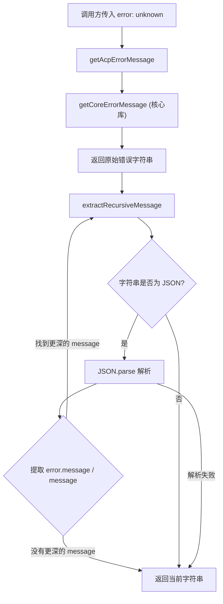

# acpErrors.ts

> 为 ACP (IDE) 客户端提取人类可读的错误信息，递归解析 Google API 嵌套 JSON 错误响应。

## 概述

`acpErrors.ts` 是一个轻量级的错误消息处理模块，专门为 ACP（Agent Client Protocol，即 IDE 客户端协议）场景设计。Google API 返回的错误信息通常包含深层嵌套的 JSON 结构，直接展示给用户体验很差。本模块通过递归解析 JSON 错误体，逐层提取最内层的 `message` 字段，最终返回一个简洁、可读的错误字符串。

## 架构图（mermaid）

## 主要导出

| 导出项 | 类型 | 说明 |
|--------|------|------|
| `getAcpErrorMessage(error: unknown): string` | 函数 | 对外唯一入口，接收任意错误对象，返回精简的人类可读错误信息 |

## 核心逻辑

### `getAcpErrorMessage(error: unknown): string`

1. 调用核心库的 `getCoreErrorMessage(error)` 将任意类型的 `error` 转为初始字符串。
2. 将该字符串传入 `extractRecursiveMessage` 进行递归解析。

### `extractRecursiveMessage(input: string): string`（内部函数）

1. 对输入字符串进行 `trim()`。
2. 判断是否以 `{`/`}` 或 `[`/`]` 包裹（即可能是 JSON）。
3. 若是，则尝试 `JSON.parse`：
   - 依次尝试提取 `parsed.error.message`、`parsed[0].error.message`、`parsed.message`。
   - 若提取到非空且不同于输入的字符串，则**递归调用自身**继续解析。
4. 若解析失败或无更深的 message，返回原始输入字符串。

该递归策略确保即使 Google API 返回多层嵌套的 JSON 错误响应（如 `{"error": {"message": "{\"error\": {\"message\": \"实际错误\"}}"} }`），也能最终提取到最内层的实际错误信息。

## 内部依赖

| 模块 | 用途 |
|------|------|
| `@google/gemini-cli-core` → `getErrorMessage` | 将任意 error 对象转为基础字符串（重命名为 `getCoreErrorMessage`） |

## 外部依赖

无。本模块不依赖任何第三方库。
