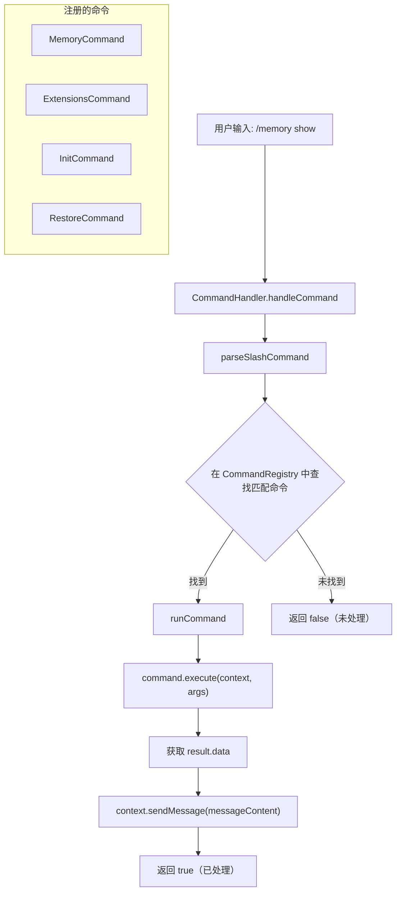

# commandHandler.ts

> 解析并执行斜杠命令（slash commands），是 ACP 会话中命令处理的统一入口。

## 概述

`commandHandler.ts` 是 ACP 子系统中的命令路由层。它负责将用户输入的斜杠命令字符串（如 `/memory show`、`/extensions install xxx`）解析为对应的 `Command` 对象并执行。内部维护一个 `CommandRegistry` 实例，在构造时自动注册所有内置命令：`MemoryCommand`、`ExtensionsCommand`、`InitCommand`、`RestoreCommand`。

## 架构图（mermaid）

## 主要导出

| 导出项 | 类型 | 说明 |
|--------|------|------|
| `CommandHandler` | 类 | 命令处理器，管理命令注册、解析和执行 |

## 核心逻辑

### `CommandHandler` 类

#### 构造函数

通过静态方法 `createRegistry()` 创建 `CommandRegistry` 并注册以下命令：
- `MemoryCommand` — 内存/记忆管理
- `ExtensionsCommand` — 扩展管理
- `InitCommand` — 项目初始化
- `RestoreCommand` — 检查点恢复

#### `getAvailableCommands(): Array<{ name, description }>`

返回所有已注册命令的名称与描述列表，用于 ACP 会话向客户端通告可用命令。

#### `handleCommand(commandText: string, context: CommandContext): Promise<boolean>`

主入口方法：
1. 调用 `parseSlashCommand` 解析命令文本。
2. 若匹配到命令，调用 `runCommand` 执行并返回 `true`。
3. 未匹配则返回 `false`。

#### `parseSlashCommand(query: string)` (private)

解析逻辑（镜像 `packages/cli/src/utils/commands.ts`）：
1. 去除前导 `/` 或 `$`，按空格分割为路径片段。
2. 从注册表的顶层命令开始，逐级匹配命令名或别名。
3. 若命令有 `subCommands`，继续深入匹配子命令。
4. 返回最终匹配到的 `Command` 对象及剩余参数字符串。

#### `runCommand(command, args, context)` (private)

1. 调用 `command.execute(context, args.split(/\s+/))`。
2. 将返回的 `result.data` 转为字符串（支持 string、含 `content` 属性的对象、或 JSON 序列化）。
3. 通过 `context.sendMessage()` 发送结果。
4. 捕获异常并发送错误消息。

## 内部依赖

| 模块 | 用途 |
|------|------|
| `./commands/types.js` | `Command`、`CommandContext` 类型定义 |
| `./commands/commandRegistry.js` | `CommandRegistry` 命令注册表 |
| `./commands/memory.js` | `MemoryCommand` 记忆管理命令 |
| `./commands/extensions.js` | `ExtensionsCommand` 扩展管理命令 |
| `./commands/init.js` | `InitCommand` 初始化命令 |
| `./commands/restore.js` | `RestoreCommand` 检查点恢复命令 |

## 外部依赖

无。
