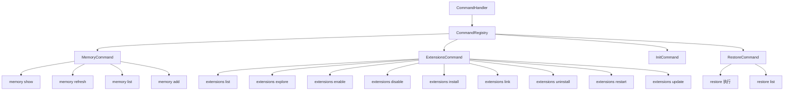

# acp/commands 架构

> ACP 模式下可用的斜杠命令集合，提供记忆管理、扩展管理、项目初始化和检查点恢复功能。

## 概述

`acp/commands/` 目录实现了在 ACP（无头/IDE）模式下可用的斜杠命令。当 IDE 用户通过 ACP 协议发送以 `/` 或 `$` 开头的命令时，`CommandHandler` 会将其路由到此处注册的命令进行处理。这些命令相比完整交互式 UI 模式下的命令集合是一个精简子集，专门适配无 UI 环境。

## 架构图



## 目录结构

```
commands/
├── types.ts             # Command 和 CommandContext 接口定义
├── commandRegistry.ts   # 命令注册表
├── memory.ts            # memory 命令（show/refresh/list/add）
├── extensions.ts        # extensions 命令（list/explore/enable/disable/install/link/uninstall/restart/update）
├── init.ts              # init 命令（创建 GEMINI.md）
└── restore.ts           # restore 命令（检查点恢复）
```

## 关键文件

| 文件 | 功能 |
|------|------|
| `types.ts` | 定义 `Command` 接口（name、description、execute 方法）、`CommandContext`（config、settings、git、sendMessage）和 `CommandExecutionResponse` |
| `commandRegistry.ts` | `CommandRegistry` 类，管理命令的注册（支持子命令递归注册）、查找和列举 |
| `memory.ts` | `MemoryCommand` 及其子命令：显示/刷新/列举/添加 GEMINI.md 记忆内容 |
| `extensions.ts` | `ExtensionsCommand` 及 9 个子命令，管理扩展的安装、卸载、启用、禁用、更新、重启、链接等 |
| `init.ts` | `InitCommand`，分析项目并创建定制的 GEMINI.md 文件 |
| `restore.ts` | `RestoreCommand` 和 `ListCheckpointsCommand`，恢复到之前的检查点状态 |

## 内部依赖

- `../../config/settings.ts` - 设置加载和作用域管理
- `../../config/extension-manager.ts` - 扩展管理器
- `../../config/mcp/mcpServerEnablement.ts` - MCP 服务器启用管理

## 外部依赖

| 依赖 | 用途 |
|------|------|
| `@google/gemini-cli-core` | 核心功能：addMemory、showMemory、refreshMemory、listMemoryFiles、performInit、performRestore、getCheckpointInfoList、listExtensions 等 |
| `node:fs/promises` | 文件系统操作 |
| `node:path` | 路径处理 |
