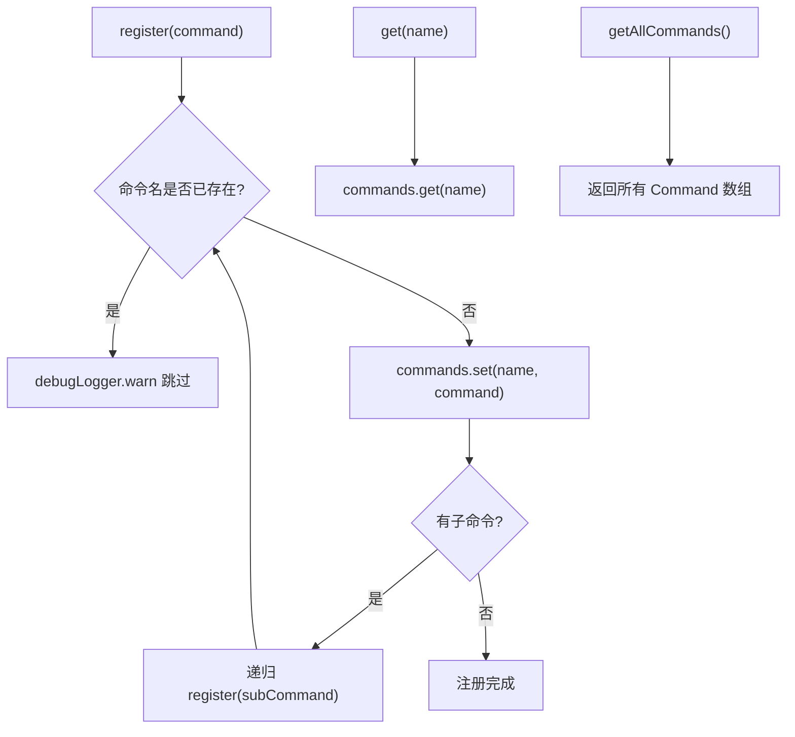

# commandRegistry.ts

> 命令注册表，负责存储、检索和管理所有 ACP 斜杠命令及其子命令。

## 概述

`commandRegistry.ts` 提供了一个简单的命令注册表实现。它使用 `Map<string, Command>` 存储命令，支持按名称注册和查找命令。注册时会自动递归注册命令的所有子命令，确保子命令也能被独立检索到。重复注册同名命令时会跳过并打印警告日志。

## 架构图（mermaid）



## 主要导出

| 导出项 | 类型 | 说明 |
|--------|------|------|
| `CommandRegistry` | 类 | 命令注册表，管理命令的注册与查找 |

## 核心逻辑

### `CommandRegistry` 类

#### 内部数据结构

```typescript
private readonly commands = new Map<string, Command>();
```

以命令名为键、`Command` 对象为值的哈希表。

#### `register(command: Command): void`

1. 检查命令名是否已存在于 `Map` 中，若是则打印警告并返回。
2. 将命令以 `command.name` 为键存入 `Map`。
3. 遍历 `command.subCommands`（若存在），对每个子命令递归调用 `register`。

这意味着例如注册 `MemoryCommand`（name = `"memory"`）时，其子命令 `ShowMemoryCommand`（name = `"memory show"`）也会被展平注册到同一张 `Map` 中。

#### `get(commandName: string): Command | undefined`

按名称精确查找命令。

#### `getAllCommands(): Command[]`

返回所有已注册命令的数组（包括通过递归注册的子命令）。

## 内部依赖

| 模块 | 用途 |
|------|------|
| `@google/gemini-cli-core` | `debugLogger` 用于打印警告日志 |
| `./types.js` | `Command` 接口定义 |

## 外部依赖

无。
