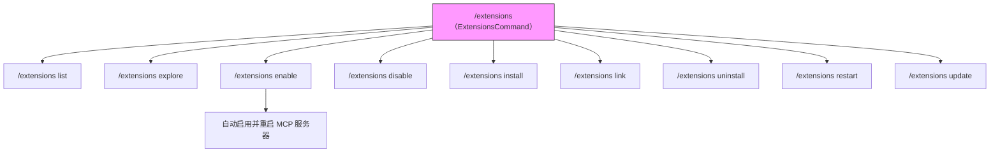

# extensions.ts

> 实现扩展管理相关的所有 ACP 斜杠命令，包括列表、探索、启用/禁用、安装/卸载、链接、重启和更新。

## 概述

`extensions.ts` 定义了 `/extensions` 命令及其 9 个子命令，覆盖了 Gemini CLI 扩展生命周期管理的所有操作。每个子命令都实现了 `Command` 接口。顶层 `ExtensionsCommand` 默认委托给 `ListExtensionsCommand` 执行（即裸 `/extensions` 等价于 `/extensions list`）。

命令支持作用域（`--scope=user|workspace|session`）和批量操作（`--all`）。启用扩展时还会自动启用并重启关联的 MCP 服务器。

## 架构图（mermaid）

## 主要导出

| 导出项 | 类型 | 说明 |
|--------|------|------|
| `ExtensionsCommand` | 类 | 顶层扩展命令，默认执行 list 子命令 |
| `ListExtensionsCommand` | 类 | 列出所有已安装扩展 |
| `ExploreExtensionsCommand` | 类 | 展示扩展探索页面 URL |
| `EnableExtensionCommand` | 类 | 启用指定扩展 |
| `DisableExtensionCommand` | 类 | 禁用指定扩展 |
| `InstallExtensionCommand` | 类 | 从 Git 仓库或本地路径安装扩展 |
| `LinkExtensionCommand` | 类 | 链接本地路径作为扩展（开发模式） |
| `UninstallExtensionCommand` | 类 | 卸载指定扩展 |
| `RestartExtensionCommand` | 类 | 重启指定扩展 |
| `UpdateExtensionCommand` | 类 | 更新指定扩展（当前仅提示需通过终端执行） |

## 核心逻辑

### `ExtensionsCommand`

顶层命令容器，`name = "extensions"`，`subCommands` 包含全部 9 个子命令。执行时委托给 `ListExtensionsCommand`。

### `getEnableDisableContext(config, args, invocationName)` (内部辅助函数)

启用/禁用命令共用的上下文解析逻辑：
1. 验证 `extensionManager` 是否为 `ExtensionManager` 实例（而非其他环境的加载器）。
2. 解析 `--scope` 参数，默认为 `SettingScope.User`。
3. 解析扩展名称参数，支持 `--all` 批量操作（自动过滤已启用/禁用的扩展）。
4. 返回 `{ extensionManager, names, scope }` 或 `{ error }` 对象。

### `EnableExtensionCommand`

启用扩展的完整流程：
1. 调用 `getEnableDisableContext` 解析参数。
2. 遍历目标扩展，调用 `extensionManager.enableExtension(name, scope)`。
3. **自动处理 MCP 服务器**：若扩展声明了 `mcpServers`，则通过 `McpServerEnablementManager` 自动启用关联的 MCP 服务器，并通过 `mcpClientManager.restartServer()` 重启。
4. 汇总所有操作结果返回。

### `DisableExtensionCommand`

与启用逻辑对称，调用 `extensionManager.disableExtension(name, scope)`。

### `InstallExtensionCommand`

1. 验证源字符串不含危险字符（`[;&|`'"]`）。
2. 通过 `inferInstallMetadata(source)` 推断安装元数据（Git URL 或本地路径）。
3. 调用 `extensionLoader.installOrUpdateExtension(metadata)` 执行安装。

### `LinkExtensionCommand`

1. 使用 `fs.stat()` 验证本地路径是否存在。
2. 以 `type: 'link'` 调用 `installOrUpdateExtension` 创建符号链接式安装。

### `UninstallExtensionCommand`

支持 `--all` 或指定名称列表，逐个调用 `extensionLoader.uninstallExtension(name, false)`。

### `RestartExtensionCommand`

过滤出活跃扩展，逐个调用 `extensionLoader.restartExtension(extension)`。

### `UpdateExtensionCommand`

当前不支持无头模式更新，返回提示用户通过终端执行 `gemini extensions update`。

## 内部依赖

| 模块 | 用途 |
|------|------|
| `./types.js` | `Command`、`CommandContext`、`CommandExecutionResponse` 接口 |
| `../../config/settings.js` | `SettingScope` 枚举 |
| `../../config/extension-manager.js` | `ExtensionManager`、`inferInstallMetadata` |
| `../../config/mcp/mcpServerEnablement.js` | `McpServerEnablementManager` MCP 服务器启用管理 |

## 外部依赖

| 模块 | 用途 |
|------|------|
| `@google/gemini-cli-core` | `listExtensions`、`Config`、`getErrorMessage` |
| `node:fs/promises` | `stat` 用于验证本地路径 |
