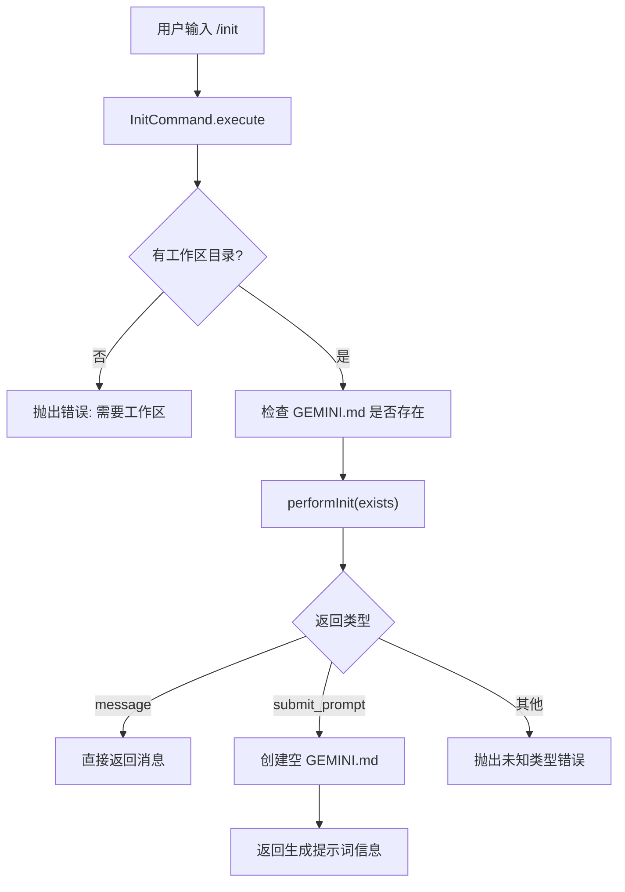

# init.ts

> 实现 `/init` 命令，分析项目并创建或初始化 GEMINI.md 配置文件。

## 概述

`init.ts` 定义了 `/init` ACP 斜杠命令。该命令用于在项目根目录创建 `GEMINI.md` 文件，这是 Gemini CLI 的项目级记忆/指令文件。命令首先检查 `GEMINI.md` 是否已存在，然后委托核心库的 `performInit` 函数决定执行策略。

由于 ACP 模式下无法直接触发 UI 交互式代理循环，当 `performInit` 返回 `submit_prompt` 类型时，命令会先创建空的 `GEMINI.md` 文件，并将生成提示词以信息消息的形式返回给客户端。

## 架构图（mermaid）

## 主要导出

| 导出项 | 类型 | 说明 |
|--------|------|------|
| `InitCommand` | 类 | `/init` 命令实现，创建项目 GEMINI.md 文件 |

## 核心逻辑

### `InitCommand` 类

| 属性 | 值 | 说明 |
|------|-----|------|
| `name` | `"init"` | 命令名称 |
| `description` | `"Analyzes the project and creates a tailored GEMINI.md file"` | 命令描述 |
| `requiresWorkspace` | `true` | 必须在工作区中运行 |

#### `execute(context, args): Promise<CommandExecutionResponse>`

1. 获取目标目录 `config.getTargetDir()`，若为空则抛出错误。
2. 拼接 `GEMINI.md` 路径，检查文件是否存在。
3. 调用 `performInit(existsAlready)` 获取执行策略。
4. 根据返回类型处理：
   - **`message`**: 直接返回核心库提供的消息（如"文件已存在"提示）。
   - **`submit_prompt`**: 先 `writeFileSync` 创建空 `GEMINI.md`，然后将核心库返回的提示词包装为 info 消息返回，告知用户可在新对话中使用该提示词来填充文件内容。
   - **其他**: 抛出未知类型错误。

## 内部依赖

| 模块 | 用途 |
|------|------|
| `./types.js` | `Command`、`CommandContext`、`CommandExecutionResponse` 接口 |

## 外部依赖

| 模块 | 用途 |
|------|------|
| `@google/gemini-cli-core` | `performInit` 核心初始化逻辑 |
| `node:fs` | `existsSync`、`writeFileSync` 文件操作 |
| `node:path` | `join` 路径拼接 |
