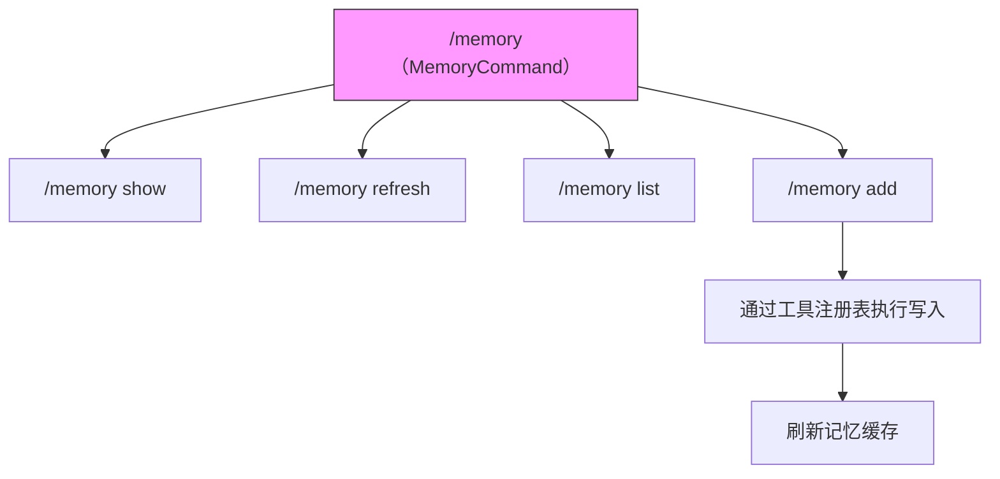

# memory.ts

> 实现记忆管理相关的 ACP 斜杠命令，包括查看、刷新、列表和添加记忆内容。

## 概述

`memory.ts` 定义了 `/memory` 命令及其 4 个子命令，用于管理 Gemini CLI 的记忆系统（即 `GEMINI.md` 文件中的内容）。记忆系统允许用户为 AI 提供持久化的项目上下文、规则和指令。

顶层 `MemoryCommand` 默认委托给 `ShowMemoryCommand`（即裸 `/memory` 等价于 `/memory show`）。

## 架构图（mermaid）



## 主要导出

| 导出项 | 类型 | 说明 |
|--------|------|------|
| `MemoryCommand` | 类 | 顶层记忆管理命令，默认执行 show 子命令 |
| `ShowMemoryCommand` | 类 | 显示当前记忆内容 |
| `RefreshMemoryCommand` | 类 | 从源文件刷新记忆 |
| `ListMemoryCommand` | 类 | 列出正在使用的 GEMINI.md 文件路径 |
| `AddMemoryCommand` | 类 | 向记忆中添加内容 |

## 核心逻辑

### `MemoryCommand`

顶层命令容器，`name = "memory"`，`requiresWorkspace = true`。执行时委托给 `ShowMemoryCommand`。

### `ShowMemoryCommand`

调用 `showMemory(config)` 返回当前记忆内容字符串。

### `RefreshMemoryCommand`

- 别名：`memory reload`
- 调用 `refreshMemory(config)` 重新从 GEMINI.md 文件加载记忆内容。

### `ListMemoryCommand`

调用 `listMemoryFiles(config)` 返回所有正在使用的 GEMINI.md 文件路径列表。

### `AddMemoryCommand`

最复杂的子命令，完整流程：
1. 将参数合并为要添加的文本。
2. 调用 `addMemory(textToAdd)` 获取操作指令。
3. 若返回 `message` 类型，直接返回消息。
4. 若返回工具调用类型：
   a. 从工具注册表获取对应工具（如 `write_file`）。
   b. 创建 `AbortController` 用于信号控制。
   c. 发送 "正在保存记忆..." 状态消息。
   d. 使用 `tool.buildAndExecute` 执行工具调用，传入清洗配置和沙箱管理器。
   e. 调用 `refreshMemory(config)` 刷新缓存。
   f. 返回确认消息。

### `DEFAULT_SANITIZATION_CONFIG` (模块常量)

```typescript
{
  allowedEnvironmentVariables: [],
  blockedEnvironmentVariables: [],
  enableEnvironmentVariableRedaction: false,
}
```

执行工具时使用的默认清洗配置，不进行环境变量过滤或脱敏。

## 内部依赖

| 模块 | 用途 |
|------|------|
| `./types.js` | `Command`、`CommandContext`、`CommandExecutionResponse` 接口 |

## 外部依赖

| 模块 | 用途 |
|------|------|
| `@google/gemini-cli-core` | `addMemory`、`listMemoryFiles`、`refreshMemory`、`showMemory` 记忆操作函数 |
