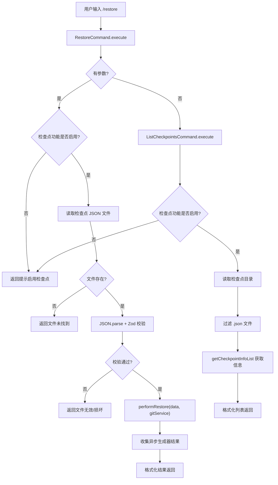

# restore.ts

> 实现检查点恢复相关的 ACP 斜杠命令，支持列出可用检查点和恢复到指定检查点。

## 概述

`restore.ts` 定义了 `/restore` 命令及 `/restore list` 子命令。检查点（Checkpoint）是 Gemini CLI 的一个功能，允许在工具调用前/后保存对话和文件状态的快照，以便用户可以回退到之前的状态。该模块提供了在 ACP 模式下列出和执行检查点恢复的能力。

恢复操作会读取检查点 JSON 文件，通过 Zod schema 校验数据有效性，然后调用核心库的 `performRestore` 异步生成器执行实际恢复流程。

## 架构图（mermaid）

## 主要导出

| 导出项 | 类型 | 说明 |
|--------|------|------|
| `RestoreCommand` | 类 | 检查点恢复命令，无参数时列出检查点，有参数时执行恢复 |
| `ListCheckpointsCommand` | 类 | 列出所有可用检查点的子命令 |

## 核心逻辑

### `RestoreCommand`

| 属性 | 值 |
|------|-----|
| `name` | `"restore"` |
| `requiresWorkspace` | `true` |
| `subCommands` | `[ListCheckpointsCommand]` |

#### `execute(context, args)` 流程

1. **无参数时**: 委托给 `ListCheckpointsCommand`。
2. **有参数时**:
   a. 检查 `config.getCheckpointingEnabled()`，未启用则返回提示。
   b. 自动补全 `.json` 后缀。
   c. 从 `config.storage.getProjectTempCheckpointsDir()` 读取检查点文件。
   d. 使用 `getToolCallDataSchema()` 获取 Zod schema 并校验 JSON 数据。
   e. 调用 `performRestore(parseResult.data, gitService)` 获取异步生成器。
   f. 遍历生成器收集所有恢复结果。
   g. 格式化输出：
      - `message` 类型: `[INFO/WARNING/ERROR] 消息内容`
      - `load_history` 类型: `Loaded history with N messages.`
      - 其他: JSON 序列化
   h. 全局 try-catch 捕获未预期的错误。

### `ListCheckpointsCommand`

#### `execute(context)` 流程

1. 检查检查点功能是否启用。
2. 确保检查点目录存在（`fs.mkdir` with `recursive: true`）。
3. 读取目录内容，过滤 `.json` 文件。
4. 若无文件返回 "No checkpoints found."。
5. 读取每个文件内容到 `Map<filename, data>`。
6. 调用 `getCheckpointInfoList(checkpointFiles)` 获取结构化信息。
7. 格式化每条记录为 Markdown 列表：
   `- **fileName**: toolName (Status: status) [timestamp]`

## 内部依赖

| 模块 | 用途 |
|------|------|
| `./types.js` | `Command`、`CommandContext`、`CommandExecutionResponse` 接口 |

## 外部依赖

| 模块 | 用途 |
|------|------|
| `@google/gemini-cli-core` | `getCheckpointInfoList`、`getToolCallDataSchema`、`isNodeError`、`performRestore` |
| `node:fs/promises` | 文件读取、目录操作 |
| `node:path` | 路径拼接 |
