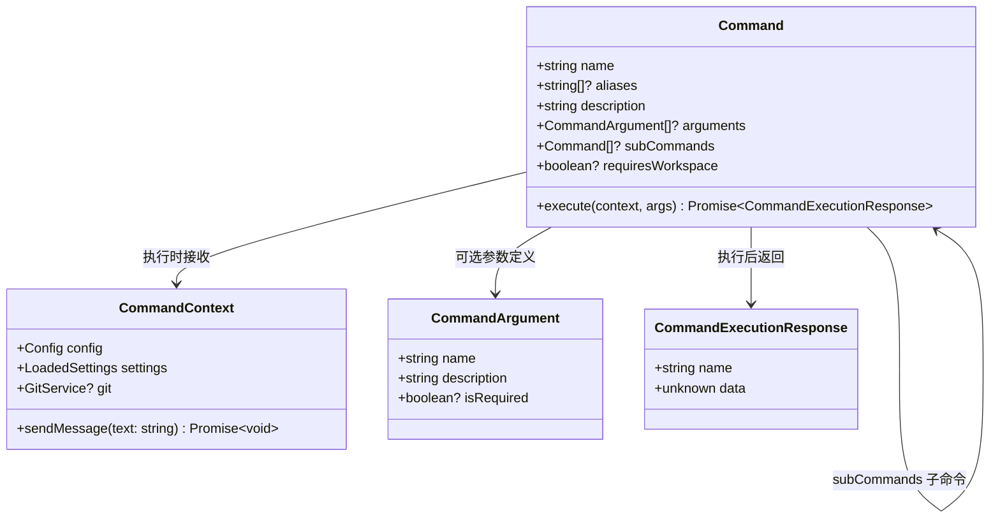

# types.ts

> 定义 ACP 命令系统的核心接口：命令上下文、命令定义和命令执行响应。

## 概述

`types.ts` 是 ACP 命令子系统的类型基础文件，定义了三个核心接口和一个辅助接口。所有 ACP 斜杠命令（如 `/memory`、`/extensions`、`/init`、`/restore`）都需要实现这里定义的 `Command` 接口，并在执行时接收 `CommandContext`、返回 `CommandExecutionResponse`。

## 架构图（mermaid）

## 主要导出

| 导出项 | 类型 | 说明 |
|--------|------|------|
| `CommandContext` | 接口 | 命令执行上下文，包含配置、设置、Git 服务和消息发送能力 |
| `CommandArgument` | 接口 | 命令参数元数据定义 |
| `Command` | 接口 | 命令定义，包含名称、描述、子命令和执行方法 |
| `CommandExecutionResponse` | 接口 | 命令执行结果，包含命令名和返回数据 |

## 核心逻辑

### `CommandContext` 接口

命令执行时的上下文环境：

| 字段 | 类型 | 必填 | 说明 |
|------|------|------|------|
| `config` | `Config` | 是 | 全局配置对象，来自核心库 |
| `settings` | `LoadedSettings` | 是 | 已加载的用户/工作区设置 |
| `git` | `GitService` | 否 | Git 服务实例（某些命令如 restore 需要） |
| `sendMessage` | `(text: string) => Promise<void>` | 是 | 向客户端发送消息的回调函数 |

### `Command` 接口

命令定义的核心接口：

| 字段 | 类型 | 必填 | 说明 |
|------|------|------|------|
| `name` | `string` | 是 | 命令名称，如 `"memory"` 或 `"memory show"` |
| `aliases` | `string[]` | 否 | 命令别名，如 `["memory reload"]` |
| `description` | `string` | 是 | 命令描述 |
| `arguments` | `CommandArgument[]` | 否 | 参数元数据列表 |
| `subCommands` | `Command[]` | 否 | 子命令列表，支持多级命令树 |
| `requiresWorkspace` | `boolean` | 否 | 是否要求工作区目录存在 |
| `execute(context, args)` | 方法 | 是 | 执行入口，返回 `CommandExecutionResponse` |

### `CommandExecutionResponse` 接口

| 字段 | 类型 | 说明 |
|------|------|------|
| `name` | `string` | 执行的命令名称 |
| `data` | `unknown` | 命令返回的数据，可以是字符串、对象等 |

## 内部依赖

| 模块 | 用途 |
|------|------|
| `@google/gemini-cli-core` | `Config`、`GitService` 类型 |
| `../../config/settings.js` | `LoadedSettings` 类型 |

## 外部依赖

无。
