# fileSystemService.ts

> 基于 ACP 连接的文件系统服务实现，支持通过 IDE 客户端代理进行文件读写操作。

## 概述

`fileSystemService.ts` 实现了 `FileSystemService` 接口的 ACP 版本。当 Gemini CLI 以 ACP 模式运行时，文件读写操作可以通过 ACP 连接委托给 IDE 客户端（如 VS Code、Zed 等）执行，而不是直接操作本地文件系统。这一设计使得 IDE 可以拦截文件操作，实现诸如虚拟文件系统、权限控制、差异预览等功能。

若客户端不支持某项文件系统能力（通过 `capabilities` 标志指示），则自动回退到传入的 `fallback` 服务进行本地操作。

## 架构图（mermaid）

```mermaid
flowchart TD
    A[Gemini CLI 核心] -->|调用 readTextFile / writeTextFile| B[AcpFileSystemService]
    B --> C{客户端支持该能力?}
    C -- 是 --> D["通过 ACP connection 代理到 IDE"]
    C -- 否 --> E["fallback: 本地 FileSystemService"]

    subgraph ACP 连接
        D --> F[IDE 客户端处理文件操作]
    end
```

## 主要导出

| 导出项 | 类型 | 说明 |
|--------|------|------|
| `AcpFileSystemService` | 类 | 实现 `FileSystemService` 接口，通过 ACP 连接代理文件操作 |

## 核心逻辑

### `AcpFileSystemService` 类

实现 `FileSystemService` 接口（来自 `@google/gemini-cli-core`）。

#### 构造函数参数

| 参数 | 类型 | 说明 |
|------|------|------|
| `connection` | `acp.AgentSideConnection` | ACP 协议连接实例 |
| `sessionId` | `string` | 当前会话 ID |
| `capabilities` | `acp.FileSystemCapability` | 客户端文件系统能力声明 |
| `fallback` | `FileSystemService` | 回退的本地文件系统服务 |

#### `readTextFile(filePath: string): Promise<string>`

- 若 `capabilities.readTextFile` 为 `true`，通过 `connection.readTextFile({ path, sessionId })` 代理读取。
- 否则委托给 `fallback.readTextFile(filePath)`。

#### `writeTextFile(filePath: string, content: string): Promise<void>`

- 若 `capabilities.writeTextFile` 为 `true`，通过 `connection.writeTextFile({ path, content, sessionId })` 代理写入。
- 否则委托给 `fallback.writeTextFile(filePath, content)`。

## 内部依赖

无项目内部依赖。

## 外部依赖

| 模块 | 用途 |
|------|------|
| `@google/gemini-cli-core` | `FileSystemService` 接口定义 |
| `@agentclientprotocol/sdk` | ACP 协议 SDK，提供 `AgentSideConnection`、`FileSystemCapability` 等类型 |
