# commands 架构

> CLI 子命令的顶层路由和分组，通过 yargs 实现 `gemini extensions/mcp/skills/hooks` 等命令。

## 概述

`commands/` 目录实现了 Gemini CLI 的非交互式子命令系统。当用户运行 `gemini extensions install ...` 或 `gemini mcp add ...` 等命令时，yargs 将请求路由到此处对应的命令模块。每个顶层命令文件（`.tsx`）作为子命令的入口点，负责注册子命令并设置中间件。实际的命令逻辑分散在各子目录中。

## 架构图

```mermaid
graph TD
    Yargs[yargs 解析器] --> Extensions[extensions.tsx]
    Yargs --> Mcp[mcp.ts]
    Yargs --> Skills[skills.tsx]
    Yargs --> Hooks[hooks.tsx]

    Extensions --> Install[extensions/install.ts]
    Extensions --> Uninstall[extensions/uninstall.ts]
    Extensions --> List[extensions/list.ts]
    Extensions --> Update[extensions/update.ts]
    Extensions --> Enable[extensions/enable.ts]
    Extensions --> Disable[extensions/disable.ts]
    Extensions --> Link[extensions/link.ts]
    Extensions --> New[extensions/new.ts]
    Extensions --> Validate[extensions/validate.ts]
    Extensions --> Configure[extensions/configure.ts]

    Mcp --> Add[mcp/add.ts]
    Mcp --> Remove[mcp/remove.ts]
    Mcp --> McpList[mcp/list.ts]
    Mcp --> McpEnable[mcp/enableDisable.ts]

    Skills --> SkillList[skills/list.ts]
    Skills --> SkillInstall[skills/install.ts]
    Skills --> SkillEnable[skills/enable.ts]
    Skills --> SkillDisable[skills/disable.ts]
    Skills --> SkillLink[skills/link.ts]
    Skills --> SkillUninstall[skills/uninstall.ts]

    Hooks --> Migrate[hooks/migrate.ts]
```



## 目录结构

```
commands/
├── extensions.tsx      # gemini extensions 命令入口
├── mcp.ts              # gemini mcp 命令入口
├── skills.tsx          # gemini skills 命令入口
├── hooks.tsx           # gemini hooks 命令入口
├── utils.ts            # 通用工具（exitCli 函数）
├── extensions/         # extensions 子命令实现
├── mcp/                # mcp 子命令实现
├── skills/             # skills 子命令实现
└── hooks/              # hooks 子命令实现
```

## 关键文件

| 文件 | 功能 |
|------|------|
| `extensions.tsx` | 注册 extensions 的 10 个子命令（install/uninstall/list/update/disable/enable/link/new/validate/configure），使用 `defer()` 延迟加载 |
| `mcp.ts` | 注册 mcp 的 5 个子命令（add/remove/list/enable/disable），使用 `defer()` 延迟加载 |
| `skills.tsx` | 注册 skills 的 6 个子命令（list/enable/disable/install/link/uninstall），使用 `defer()` 延迟加载 |
| `hooks.tsx` | 注册 hooks 的 migrate 子命令 |
| `utils.ts` | 导出 `exitCli()` 函数，执行清理后退出进程 |

## 内部依赖

- `../gemini.ts` - 引用 `initializeOutputListenersAndFlush` 确保输出可见
- `../deferred.ts` - `defer()` 函数实现延迟命令加载
- `./extensions/`、`./mcp/`、`./skills/`、`./hooks/` - 各子目录的具体命令实现

## 外部依赖

| 依赖 | 用途 |
|------|------|
| `yargs` | `CommandModule` 类型，子命令定义和路由 |
