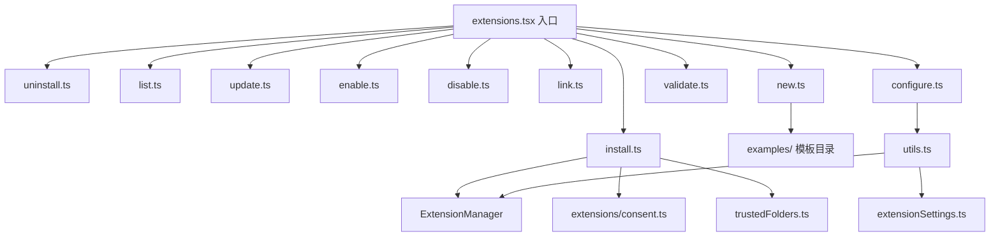

# commands/extensions 架构

> 实现 `gemini extensions` 子命令集，提供扩展的安装、卸载、更新、启用/禁用、链接、创建、验证和配置功能。

## 概述

`commands/extensions/` 目录包含 `gemini extensions <command>` 命令族的所有实现。每个文件对应一个子命令，通过 yargs `CommandModule` 定义参数和处理逻辑。这些命令直接在终端中运行（非交互式），与扩展管理器 `ExtensionManager` 交互完成扩展生命周期管理。

## 架构图



## 目录结构

```
extensions/
├── install.ts      # 安装扩展（从 Git 仓库或本地路径）
├── uninstall.ts    # 卸载扩展
├── list.ts         # 列出已安装扩展
├── update.ts       # 更新扩展
├── enable.ts       # 启用扩展
├── disable.ts      # 禁用扩展
├── link.ts         # 链接本地扩展
├── new.ts          # 从模板创建新扩展
├── validate.ts     # 验证扩展配置
├── configure.ts    # 配置扩展设置
├── utils.ts        # 共享工具函数
└── examples/       # 扩展模板示例
```

## 关键文件

| 文件 | 功能 |
|------|------|
| `install.ts` | `handleInstall()` 处理安装流程：推断安装元数据、检查文件夹信任、请求安全同意、调用 `ExtensionManager.installOrUpdateExtension()` |
| `uninstall.ts` | 卸载指定或全部扩展 |
| `list.ts` | 列出所有已安装扩展及其状态 |
| `update.ts` | 检查并应用扩展更新 |
| `enable.ts` / `disable.ts` | 按作用域（user/workspace/session）启用/禁用扩展 |
| `link.ts` | 将本地目录链接为扩展（开发用途） |
| `new.ts` | 从 `examples/` 目录复制模板创建新扩展项目 |
| `validate.ts` | 验证扩展的 `gemini-extension.json` 配置 |
| `configure.ts` | 交互式配置扩展的设置项 |
| `utils.ts` | 共享辅助函数：`getExtensionManager()`、`configureExtension()`、`configureSpecificSetting()`、`getFormattedSettingValue()` |

## 内部依赖

- `../../config/extension-manager.ts` - `ExtensionManager` 扩展管理器
- `../../config/extensions/consent.ts` - 安装同意处理
- `../../config/extensions/extensionSettings.ts` - 扩展设置管理
- `../../config/settings.ts` - 全局设置
- `../../config/trustedFolders.ts` - 文件夹信任管理
- `../utils.ts` - `exitCli()` 退出函数

## 外部依赖

| 依赖 | 用途 |
|------|------|
| `yargs` | CommandModule 类型，子命令参数定义 |
| `chalk` | 终端颜色输出 |
| `prompts` | 交互式用户确认 |
| `@google/gemini-cli-core` | debugLogger、FolderTrustDiscoveryService、getErrorMessage 等 |
