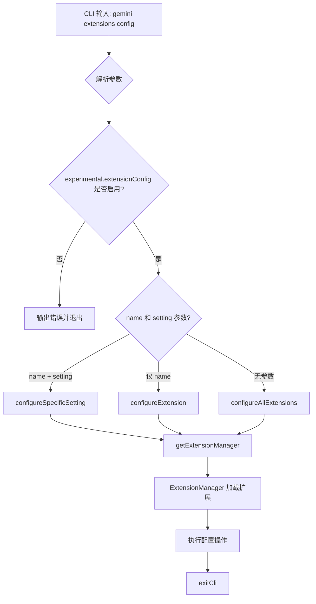

# configure.ts

> 提供扩展配置的 CLI 子命令，支持按名称、设置项和作用域对扩展进行交互式配置。

## 概述

`configure.ts` 实现了 `gemini extensions config` 命令，用于配置已安装扩展的设置。支持三种使用模式：

1. 配置所有扩展的所有设置（无参数）
2. 配置指定扩展的所有设置（提供扩展名）
3. 配置指定扩展的特定设置项（提供扩展名和设置名）

命令还支持 `--scope` 选项，可在 `user`（用户级别）或 `workspace`（工作区级别）之间选择配置作用域。

## 架构图（mermaid）

## 主要导出

| 导出名 | 类型 | 说明 |
|--------|------|------|
| `configureCommand` | `CommandModule<object, ConfigureArgs>` | yargs 命令模块，定义 `config [name] [setting]` 子命令 |

## 核心逻辑

1. **参数解析**：通过 yargs 定义两个位置参数（`name`、`setting`）和一个选项（`scope`，默认 `user`）。
2. **实验性功能检查**：读取合并后的设置，判断 `experimental.extensionConfig` 是否为 `true`（默认启用）。若被禁用则输出错误并退出。
3. **安全校验**：如果提供了扩展名，检查其中是否包含路径分隔符（`/`、`\`）或 `..`，防止路径穿越攻击。
4. **三级分派**：
   - `name + setting` -> `configureSpecificSetting()`：配置指定扩展的某个设置项。
   - `name` -> `configureExtension()`：配置指定扩展的所有设置项。
   - 无参数 -> `configureAllExtensions()`：配置全部扩展的所有设置项。
5. **退出**：调用 `exitCli()` 完成清理并退出进程。

## 内部依赖

| 模块路径 | 导入项 | 用途 |
|----------|--------|------|
| `./utils.js` | `configureAllExtensions`, `configureExtension`, `configureSpecificSetting`, `getExtensionManager` | 扩展配置的核心逻辑实现 |
| `../../config/extensions/extensionSettings.js` | `ExtensionSettingScope` (type) | 设置作用域类型定义 |
| `../../config/settings.js` | `loadSettings` | 加载合并后的项目设置 |
| `../utils.js` | `exitCli` | CLI 退出并执行清理 |

## 外部依赖

| 包名 | 导入项 | 用途 |
|------|--------|------|
| `yargs` | `CommandModule` (type) | 命令模块类型定义 |
| `@google/gemini-cli-core` | `coreEvents`, `debugLogger` | 事件反馈系统和调试日志 |
