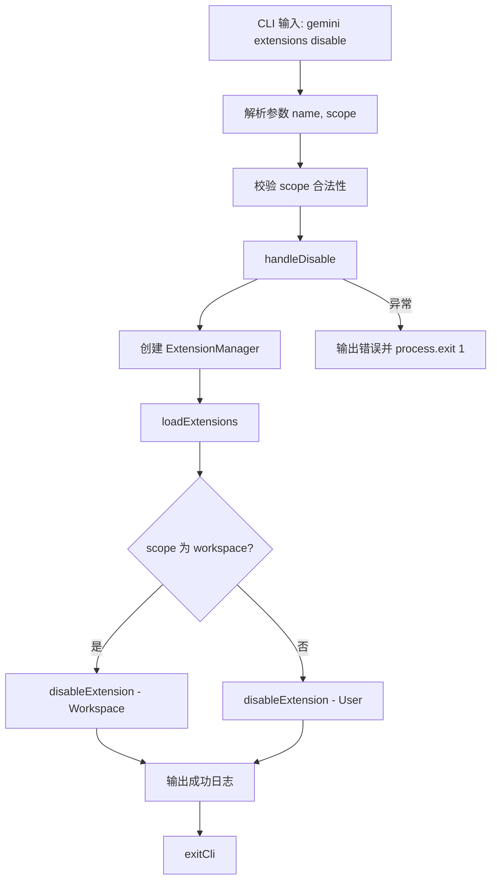

# disable.ts

> 提供禁用已安装扩展的 CLI 子命令，支持用户级和工作区级作用域。

## 概述

`disable.ts` 实现了 `gemini extensions disable` 命令，用于在指定作用域内禁用某个已安装的扩展。通过 `ExtensionManager` 加载扩展列表后，调用其 `disableExtension` 方法完成禁用操作。支持 `user` 和 `workspace` 两种作用域。

## 架构图（mermaid）

## 主要导出

| 导出名 | 类型 | 说明 |
|--------|------|------|
| `handleDisable` | `(args: DisableArgs) => Promise<void>` | 禁用扩展的核心处理函数 |
| `disableCommand` | `CommandModule` | yargs 命令模块，定义 `disable [--scope] <name>` 子命令 |

## 核心逻辑

1. **参数校验**：通过 yargs 的 `.check()` 方法验证 `scope` 值必须为 `SettingScope` 枚举中的合法值（不区分大小写）。
2. **ExtensionManager 初始化**：使用当前工作目录、非交互式授权回调和设置加载器创建实例。
3. **扩展加载**：调用 `loadExtensions()` 扫描并加载所有已安装扩展。
4. **禁用操作**：根据 `scope` 参数选择 `SettingScope.Workspace` 或 `SettingScope.User`，调用 `disableExtension(name, scope)`。
5. **错误处理**：捕获异常后通过 `debugLogger.error` 输出错误信息并以退出码 1 终止进程。

## 内部依赖

| 模块路径 | 导入项 | 用途 |
|----------|--------|------|
| `../../config/settings.js` | `loadSettings`, `SettingScope` | 加载设置和作用域枚举 |
| `../../config/extension-manager.js` | `ExtensionManager` | 扩展管理器，执行禁用操作 |
| `../../config/extensions/consent.js` | `requestConsentNonInteractive` | 非交互式授权请求回调 |
| `../../config/extensions/extensionSettings.js` | `promptForSetting` | 设置项输入提示回调 |
| `../utils.js` | `exitCli` | CLI 退出并执行清理 |

## 外部依赖

| 包名 | 导入项 | 用途 |
|------|--------|------|
| `yargs` | `CommandModule` (type) | 命令模块类型定义 |
| `@google/gemini-cli-core` | `debugLogger`, `getErrorMessage` | 调试日志和错误信息提取 |
