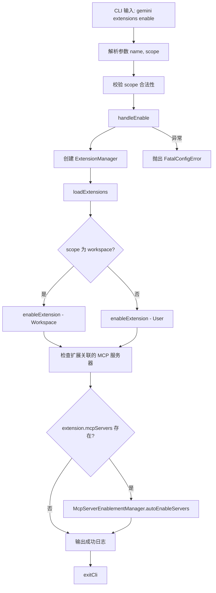

# enable.ts

> 提供启用已安装扩展的 CLI 子命令，支持作用域选择并自动启用关联的 MCP 服务器。

## 概述

`enable.ts` 实现了 `gemini extensions enable` 命令，用于在指定作用域内启用某个已安装的扩展。除了启用扩展本身，还会自动检测该扩展关联的 MCP 服务器，并将之前被禁用的服务器重新启用。如果未指定作用域，则在所有作用域中启用。

## 架构图（mermaid）

## 主要导出

| 导出名 | 类型 | 说明 |
|--------|------|------|
| `handleEnable` | `(args: EnableArgs) => Promise<void>` | 启用扩展的核心处理函数 |
| `enableCommand` | `CommandModule` | yargs 命令模块，定义 `enable [--scope] <name>` 子命令 |

## 核心逻辑

1. **参数校验**：通过 yargs 的 `.check()` 验证 `scope` 值是否为合法的 `SettingScope` 枚举值。
2. **ExtensionManager 初始化与加载**：创建管理器实例并加载所有扩展。
3. **启用扩展**：根据 `scope` 调用 `enableExtension(name, scope)`；未指定 scope 时使用 User 级别。
4. **自动启用 MCP 服务器**：查找已启用扩展的 `mcpServers` 配置，通过 `McpServerEnablementManager.autoEnableServers()` 自动启用被禁用的关联服务器。对于每个重新启用的服务器输出日志提示。
5. **错误处理**：捕获异常后包装为 `FatalConfigError` 抛出（与 `disable` 命令的 `process.exit(1)` 行为不同）。

## 内部依赖

| 模块路径 | 导入项 | 用途 |
|----------|--------|------|
| `../../config/settings.js` | `loadSettings`, `SettingScope` | 加载设置和作用域枚举 |
| `../../config/extension-manager.js` | `ExtensionManager` | 扩展管理器 |
| `../../config/extensions/consent.js` | `requestConsentNonInteractive` | 非交互式授权请求回调 |
| `../../config/extensions/extensionSettings.js` | `promptForSetting` | 设置项输入提示回调 |
| `../../config/mcp/mcpServerEnablement.js` | `McpServerEnablementManager` | MCP 服务器启用状态管理 |
| `../utils.js` | `exitCli` | CLI 退出并执行清理 |

## 外部依赖

| 包名 | 导入项 | 用途 |
|------|--------|------|
| `yargs` | `CommandModule` (type) | 命令模块类型定义 |
| `@google/gemini-cli-core` | `debugLogger`, `FatalConfigError`, `getErrorMessage` | 调试日志、致命配置错误和错误信息提取 |
