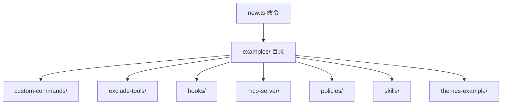

# commands/extensions/examples 架构

> 扩展模板示例集合，供 `gemini extensions new --template` 命令使用以快速创建新扩展。

## 概述

`examples/` 目录包含多种预置的扩展模板，每个子目录代表一种扩展类型的示例项目。当用户运行 `gemini extensions new --template <name> <path>` 时，`new.ts` 命令会将对应模板目录的内容复制到指定路径，帮助开发者快速启动扩展开发。

## 架构图



## 目录结构

```
examples/
├── custom-commands/        # 自定义命令扩展模板
│   ├── gemini-extension.json
│   └── commands/fs/grep-code.toml
├── exclude-tools/          # 排除工具扩展模板
│   └── gemini-extension.json
├── hooks/                  # 钩子扩展模板
│   ├── gemini-extension.json
│   ├── hooks/hooks.json
│   └── scripts/on-start.js
├── mcp-server/             # MCP 服务器扩展模板
│   ├── gemini-extension.json
│   ├── package.json
│   ├── example.js
│   └── README.md
├── policies/               # 策略扩展模板
│   ├── gemini-extension.json
│   ├── policies/policies.toml
│   └── README.md
├── skills/                 # 技能扩展模板
│   ├── gemini-extension.json
│   └── skills/greeter/SKILL.md
└── themes-example/         # 主题扩展模板
    ├── gemini-extension.json
    └── README.md
```

## 关键文件

| 文件 | 功能 |
|------|------|
| `custom-commands/gemini-extension.json` | 自定义命令扩展配置示例，展示如何通过 TOML 文件定义斜杠命令 |
| `hooks/gemini-extension.json` | 钩子扩展配置示例，展示如何定义 SessionStart 等事件钩子 |
| `mcp-server/example.js` | MCP 服务器实现示例，展示如何创建一个提供工具的 MCP 服务器 |
| `policies/policies/policies.toml` | 策略定义示例，展示如何通过扩展提供策略规则 |
| `skills/skills/greeter/SKILL.md` | Agent 技能定义示例，展示 SKILL.md 的格式 |
| `themes-example/gemini-extension.json` | 主题扩展配置示例 |

## 内部依赖

该目录为纯静态资源，不直接依赖其他代码模块。仅被 `../new.ts` 命令引用和复制。

## 外部依赖

无运行时依赖。各模板中的 `gemini-extension.json` 遵循 Gemini CLI 扩展配置规范。
