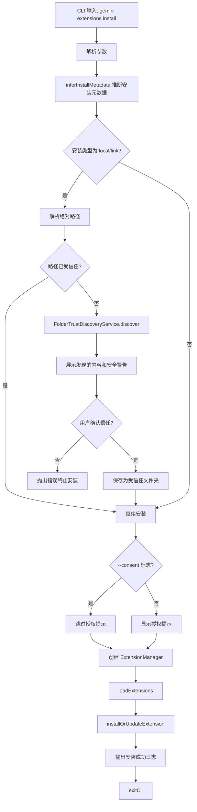

# install.ts

> 提供从 Git 仓库 URL 或本地路径安装扩展的 CLI 子命令，包含信任检查和用户授权流程。

## 概述

`install.ts` 实现了 `gemini extensions install` 命令，是扩展安装的主要入口。它支持从 Git 仓库 URL 或本地路径安装扩展，并提供完整的安全保障：

- 对本地路径安装进行文件夹信任检查
- 通过 `FolderTrustDiscoveryService` 发现扩展包含的命令、MCP 服务器、钩子、技能和设置
- 向用户展示发现结果并请求授权
- 支持 `--auto-update`、`--pre-release`、`--ref`、`--consent` 等选项

## 架构图（mermaid）

## 主要导出

| 导出名 | 类型 | 说明 |
|--------|------|------|
| `handleInstall` | `(args: InstallArgs) => Promise<void>` | 安装扩展的核心处理函数 |
| `installCommand` | `CommandModule` | yargs 命令模块，定义 `install <source>` 子命令 |

## 核心逻辑

1. **元数据推断**：调用 `inferInstallMetadata(source, options)` 根据输入源推断安装类型（git/local/link）和相关元数据。
2. **本地路径信任检查**：
   - 将路径解析为绝对路径和真实路径（解析符号链接）。
   - 通过 `isWorkspaceTrusted()` 检查路径是否已受信任。
   - 未受信任时，执行 `FolderTrustDiscoveryService.discover()` 扫描发现内容。
   - 构建包含安全警告、发现错误和发现内容（Commands、MCP Servers、Hooks、Skills、Settings）的提示信息。
   - 用户确认后通过 `loadTrustedFolders().setValue()` 保存信任记录。
3. **授权处理**：如果传入 `--consent` 标志，跳过授权提示直接同意。
4. **安装执行**：创建 `ExtensionManager` 实例，调用 `installOrUpdateExtension(installMetadata)` 完成安装。
5. **错误处理**：捕获所有异常，通过 `debugLogger.error` 输出后以退出码 1 终止。

## 内部依赖

| 模块路径 | 导入项 | 用途 |
|----------|--------|------|
| `../../config/extension-manager.js` | `ExtensionManager`, `inferInstallMetadata` | 扩展管理器和安装元数据推断 |
| `../../config/extensions/consent.js` | `INSTALL_WARNING_MESSAGE`, `promptForConsentNonInteractive`, `requestConsentNonInteractive` | 安装警告信息和授权流程 |
| `../../config/settings.js` | `loadSettings` | 加载项目设置 |
| `../../config/trustedFolders.js` | `isWorkspaceTrusted`, `loadTrustedFolders`, `TrustLevel` | 文件夹信任管理 |
| `../../config/extensions/extensionSettings.js` | `promptForSetting` | 设置项输入提示回调 |
| `../utils.js` | `exitCli` | CLI 退出并执行清理 |

## 外部依赖

| 包名 | 导入项 | 用途 |
|------|--------|------|
| `yargs` | `CommandModule` (type) | 命令模块类型定义 |
| `node:path` | `path` | 路径解析 |
| `chalk` | `chalk` | 终端彩色输出 |
| `@google/gemini-cli-core` | `debugLogger`, `FolderTrustDiscoveryService`, `getRealPath`, `getErrorMessage` | 调试日志、文件夹信任发现、真实路径解析、错误信息提取 |
