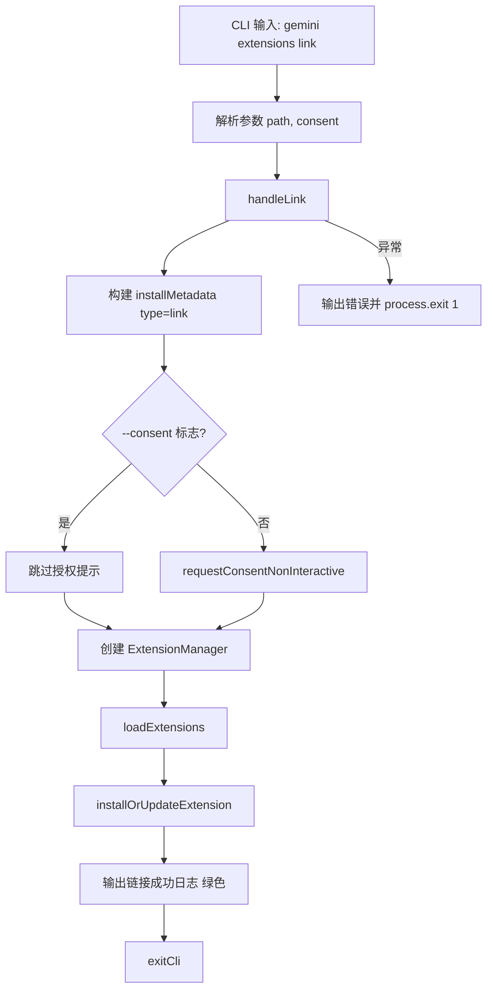

# link.ts

> 提供从本地路径链接扩展的 CLI 子命令，链接后对源路径的修改会实时反映。

## 概述

`link.ts` 实现了 `gemini extensions link` 命令，用于将本地路径上的扩展以"链接"方式安装。与 `install` 不同，链接模式不会复制扩展文件，而是直接引用源路径，因此对源路径的任何修改都会立即生效。这对扩展开发调试非常有用。

## 架构图（mermaid）

## 主要导出

| 导出名 | 类型 | 说明 |
|--------|------|------|
| `handleLink` | `(args: InstallArgs) => Promise<void>` | 链接扩展的核心处理函数 |
| `linkCommand` | `CommandModule` | yargs 命令模块，定义 `link <path>` 子命令 |

## 核心逻辑

1. **构建安装元数据**：直接创建 `ExtensionInstallMetadata` 对象，设置 `type: 'link'` 和 `source` 为传入路径。
2. **授权处理**：与 `install` 类似，如果传入 `--consent` 标志则跳过授权提示。
3. **安装执行**：通过 `ExtensionManager.installOrUpdateExtension()` 完成链接操作。
4. **成功输出**：使用 `chalk.green()` 输出绿色的成功信息。
5. **错误处理**：捕获异常后以退出码 1 终止。

## 内部依赖

| 模块路径 | 导入项 | 用途 |
|----------|--------|------|
| `../../config/extensions/consent.js` | `INSTALL_WARNING_MESSAGE`, `requestConsentNonInteractive` | 安装警告信息和授权流程 |
| `../../config/extension-manager.js` | `ExtensionManager` | 扩展管理器 |
| `../../config/settings.js` | `loadSettings` | 加载项目设置 |
| `../../config/extensions/extensionSettings.js` | `promptForSetting` | 设置项输入提示回调 |
| `../utils.js` | `exitCli` | CLI 退出并执行清理 |

## 外部依赖

| 包名 | 导入项 | 用途 |
|------|--------|------|
| `yargs` | `CommandModule` (type) | 命令模块类型定义 |
| `chalk` | `chalk` | 终端彩色输出 |
| `@google/gemini-cli-core` | `debugLogger`, `getErrorMessage`, `ExtensionInstallMetadata` (type) | 调试日志、错误信息提取和安装元数据类型 |
