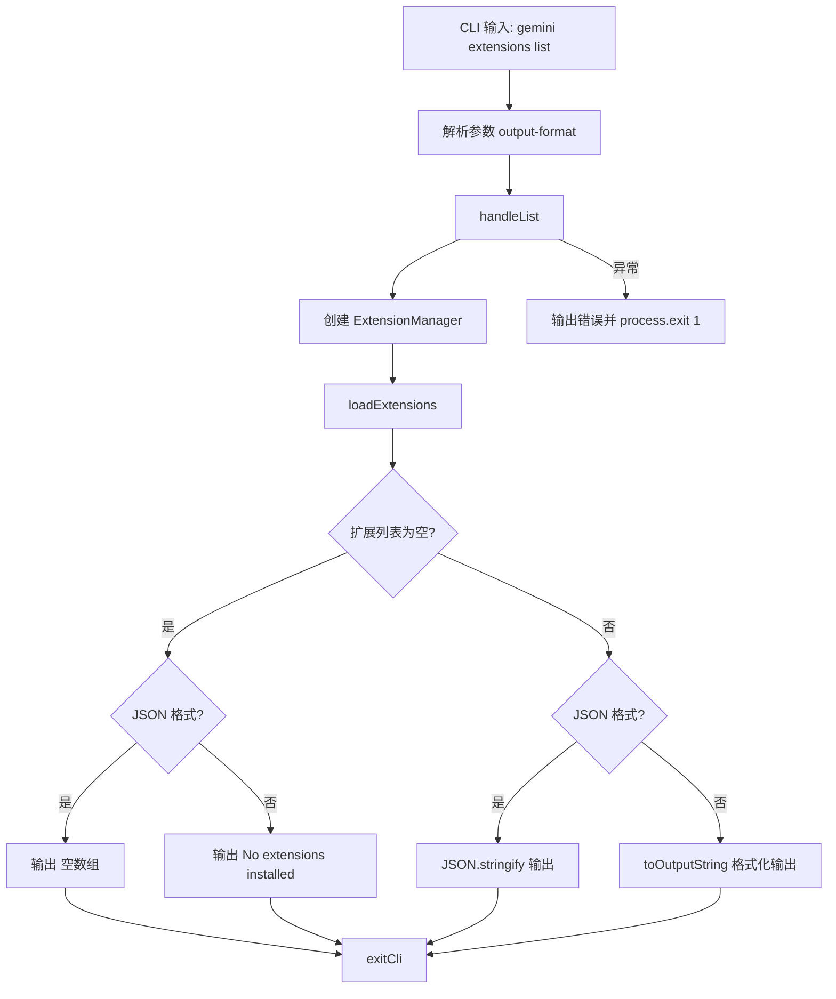

# list.ts

> 提供列出所有已安装扩展的 CLI 子命令，支持文本和 JSON 两种输出格式。

## 概述

`list.ts` 实现了 `gemini extensions list` 命令，用于显示当前工作区中所有已安装的扩展信息。支持通过 `--output-format` 选项选择输出格式：`text`（默认，人类可读）或 `json`（结构化数据，便于脚本解析）。

## 架构图（mermaid）

## 主要导出

| 导出名 | 类型 | 说明 |
|--------|------|------|
| `handleList` | `(options?: { outputFormat?: 'text' \| 'json' }) => Promise<void>` | 列出扩展的核心处理函数 |
| `listCommand` | `CommandModule` | yargs 命令模块，定义 `list` 子命令 |

## 核心逻辑

1. **ExtensionManager 初始化**：使用当前工作目录和标准配置创建实例。
2. **加载扩展**：调用 `loadExtensions()` 获取所有已安装扩展的列表。
3. **空列表处理**：无扩展时根据输出格式输出 `[]` 或 `"No extensions installed."`。
4. **格式化输出**：
   - JSON 模式：使用 `JSON.stringify(extensions, null, 2)` 输出格式化的 JSON。
   - Text 模式：对每个扩展调用 `extensionManager.toOutputString(extension)` 生成人类可读的字符串，以双换行分隔。

## 内部依赖

| 模块路径 | 导入项 | 用途 |
|----------|--------|------|
| `../../config/extension-manager.js` | `ExtensionManager` | 扩展管理器 |
| `../../config/extensions/consent.js` | `requestConsentNonInteractive` | 非交互式授权请求回调 |
| `../../config/settings.js` | `loadSettings` | 加载项目设置 |
| `../../config/extensions/extensionSettings.js` | `promptForSetting` | 设置项输入提示回调 |
| `../utils.js` | `exitCli` | CLI 退出并执行清理 |

## 外部依赖

| 包名 | 导入项 | 用途 |
|------|--------|------|
| `yargs` | `CommandModule` (type) | 命令模块类型定义 |
| `@google/gemini-cli-core` | `debugLogger`, `getErrorMessage` | 调试日志和错误信息提取 |
