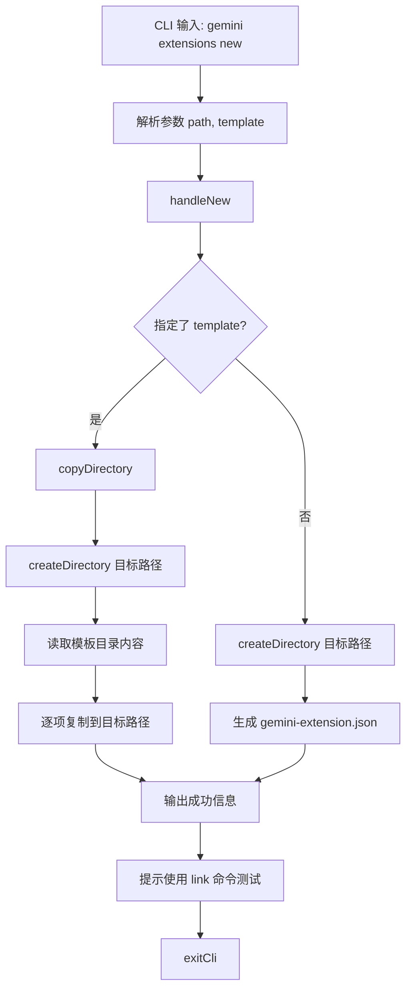

# new.ts

> 提供从模板创建新扩展脚手架的 CLI 子命令，支持使用内置样板模板或生成最小化扩展结构。

## 概述

`new.ts` 实现了 `gemini extensions new` 命令，用于在指定路径创建一个新的扩展项目。支持两种模式：

1. **模板模式**：从内置的 `examples` 目录中选择一个样板模板，将其完整复制到目标路径。
2. **最小化模式**：不指定模板时，仅创建目录并生成包含 `name` 和 `version` 字段的 `gemini-extension.json` 清单文件。

## 架构图（mermaid）

## 主要导出

| 导出名 | 类型 | 说明 |
|--------|------|------|
| `newCommand` | `CommandModule` | yargs 命令模块，定义 `new <path> [template]` 子命令 |

## 核心逻辑

1. **模板发现**：`getBoilerplateChoices()` 读取内置 `examples` 目录，提取所有子目录名作为可用模板选项。这些选项在 yargs builder 阶段动态加载。
2. **路径存在性检查**：`pathExists()` 使用 `fs.access()` 检查目标路径是否已存在。`createDirectory()` 在路径已存在时抛出错误。
3. **模板复制**：`copyDirectory()` 使用 `fs.cp()` 递归复制模板目录中的所有文件到目标路径。
4. **最小化清单生成**：无模板时，使用路径的 `basename` 作为扩展名称，生成包含 `name` 和 `version: "1.0.0"` 的 JSON 清单文件。
5. **使用提示**：创建完成后输出 `gemini extensions link <path>` 命令的提示，方便开发者快速测试。

## 内部依赖

| 模块路径 | 导入项 | 用途 |
|----------|--------|------|
| `../utils.js` | `exitCli` | CLI 退出并执行清理 |

## 外部依赖

| 包名 | 导入项 | 用途 |
|------|--------|------|
| `yargs` | `CommandModule` (type) | 命令模块类型定义 |
| `node:fs/promises` | `access`, `cp`, `mkdir`, `readdir`, `writeFile` | 文件系统操作 |
| `node:path` | `join`, `dirname`, `basename` | 路径处理 |
| `node:url` | `fileURLToPath` | 将 `import.meta.url` 转换为文件路径 |
| `@google/gemini-cli-core` | `debugLogger` | 调试日志 |
