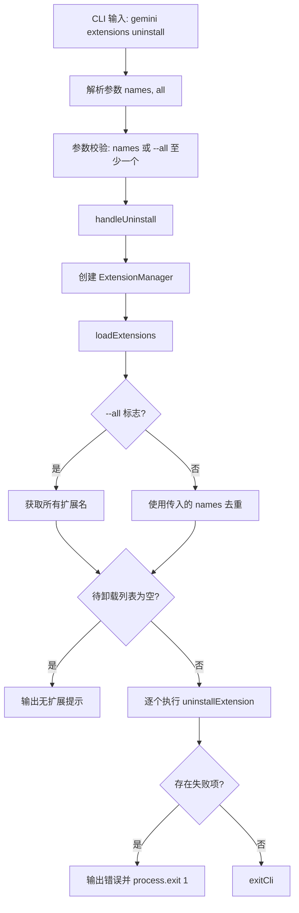

# uninstall.ts

> 提供卸载一个或多个已安装扩展的 CLI 子命令，支持按名称批量卸载或卸载全部扩展。

## 概述

`uninstall.ts` 实现了 `gemini extensions uninstall` 命令，支持两种卸载模式：

1. **按名称卸载**：提供一个或多个扩展名称（或源路径）进行精确卸载。
2. **全部卸载**：使用 `--all` 标志卸载所有已安装的扩展。

命令会逐个执行卸载操作，即使部分扩展卸载失败也会继续处理剩余扩展，最终汇总报告所有失败项。

## 架构图（mermaid）

## 主要导出

| 导出名 | 类型 | 说明 |
|--------|------|------|
| `handleUninstall` | `(args: UninstallArgs) => Promise<void>` | 卸载扩展的核心处理函数 |
| `uninstallCommand` | `CommandModule` | yargs 命令模块，定义 `uninstall [names..]` 子命令 |

## 核心逻辑

1. **参数校验**：通过 yargs 的 `.check()` 确保至少提供一个扩展名或使用 `--all` 标志。
2. **卸载目标确定**：
   - `--all` 模式：从 `extensionManager.getExtensions()` 获取全部扩展名。
   - 按名称模式：对输入名称使用 `Set` 去重。
3. **逐个卸载**：在 `for` 循环中逐个调用 `extensionManager.uninstallExtension(name, false)`。第二个参数 `false` 表示不跳过确认。
4. **错误收集**：每次卸载失败时记录 `{ name, error }` 到错误数组，不中断循环。
5. **结果报告**：所有操作完成后，如果存在失败项则逐条输出错误并以退出码 1 终止。

## 内部依赖

| 模块路径 | 导入项 | 用途 |
|----------|--------|------|
| `../../config/extension-manager.js` | `ExtensionManager` | 扩展管理器 |
| `../../config/extensions/consent.js` | `requestConsentNonInteractive` | 非交互式授权请求回调 |
| `../../config/settings.js` | `loadSettings` | 加载项目设置 |
| `../../config/extensions/extensionSettings.js` | `promptForSetting` | 设置项输入提示回调 |
| `../utils.js` | `exitCli` | CLI 退出并执行清理 |

## 外部依赖

| 包名 | 导入项 | 用途 |
|------|--------|------|
| `yargs` | `CommandModule` (type) | 命令模块类型定义 |
| `@google/gemini-cli-core` | `debugLogger`, `getErrorMessage` | 调试日志和错误信息提取 |
