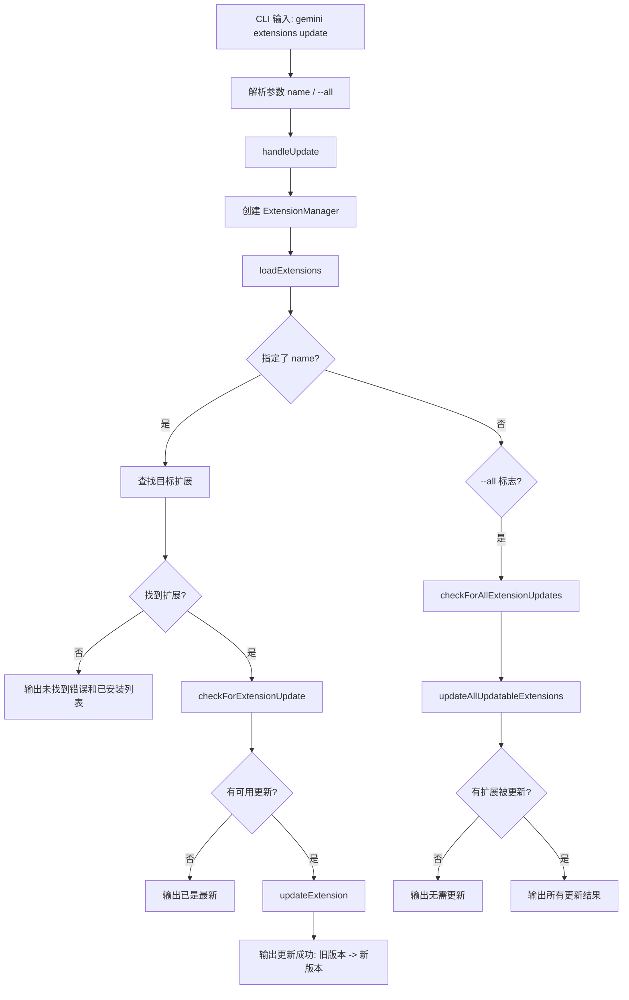

# update.ts

> 提供更新扩展到最新版本的 CLI 子命令，支持更新单个扩展或批量更新所有扩展。

## 概述

`update.ts` 实现了 `gemini extensions update` 命令，提供两种更新模式：

1. **单个更新**：指定扩展名称，检查并更新该扩展到最新版本。
2. **批量更新**：使用 `--all` 标志检查所有扩展的更新并批量执行。

两种模式互斥（通过 yargs `.conflicts()` 约束）。更新前会先检查是否有可用更新，避免不必要的操作。

## 架构图（mermaid）

## 主要导出

| 导出名 | 类型 | 说明 |
|--------|------|------|
| `handleUpdate` | `(args: UpdateArgs) => Promise<void>` | 更新扩展的核心处理函数 |
| `updateCommand` | `CommandModule` | yargs 命令模块，定义 `update [<name>] [--all]` 子命令 |

## 核心逻辑

1. **单个更新流程**：
   - 在已加载的扩展列表中查找目标扩展。
   - 未找到时输出错误信息，并列出所有已安装扩展供参考。
   - 检查 `installMetadata` 是否存在（无元数据则无法更新）。
   - 调用 `checkForExtensionUpdate()` 检查是否有新版本。
   - 有更新时调用 `updateExtension()` 执行更新，根据 `experimental.extensionReloading` 设置决定是否热重载。
   - 比较更新前后版本号，输出相应的成功或已是最新的信息。

2. **批量更新流程**：
   - 调用 `checkForAllExtensionUpdates()` 检查所有扩展的更新状态，通过回调收集每个扩展的状态。
   - 调用 `updateAllUpdatableExtensions()` 批量更新所有可更新的扩展。
   - 过滤掉版本号未变化的更新结果。
   - 使用 `updateOutput()` 辅助函数格式化输出每个更新的结果。

## 内部依赖

| 模块路径 | 导入项 | 用途 |
|----------|--------|------|
| `../../config/extensions/update.js` | `updateAllUpdatableExtensions`, `ExtensionUpdateInfo`, `checkForAllExtensionUpdates`, `updateExtension` | 扩展更新核心功能 |
| `../../config/extensions/github.js` | `checkForExtensionUpdate` | 从 GitHub 检查单个扩展的更新 |
| `../../ui/state/extensions.js` | `ExtensionUpdateState` | 扩展更新状态枚举 |
| `../../config/extension-manager.js` | `ExtensionManager` | 扩展管理器 |
| `../../config/extensions/consent.js` | `requestConsentNonInteractive` | 非交互式授权请求回调 |
| `../../config/settings.js` | `loadSettings` | 加载项目设置 |
| `../../config/extensions/extensionSettings.js` | `promptForSetting` | 设置项输入提示回调 |
| `../utils.js` | `exitCli` | CLI 退出并执行清理 |

## 外部依赖

| 包名 | 导入项 | 用途 |
|------|--------|------|
| `yargs` | `CommandModule` (type) | 命令模块类型定义 |
| `@google/gemini-cli-core` | `coreEvents`, `debugLogger`, `getErrorMessage` | 事件反馈、调试日志和错误信息提取 |
