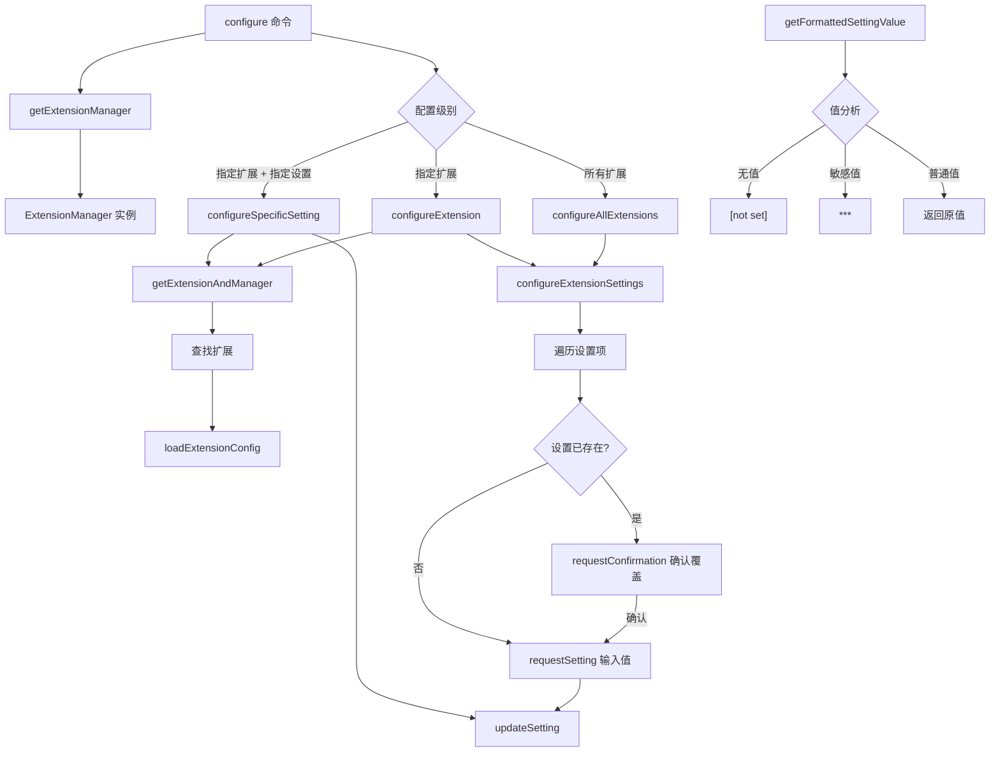

# utils.ts

> 提供扩展配置命令的共享工具函数，包括扩展管理器获取、单项/全量配置和设置值格式化。

## 概述

`utils.ts` 是 `extensions` 命令组的工具模块，为 `configure.ts` 等命令提供核心配置逻辑。主要功能包括：

- 创建和初始化 `ExtensionManager` 实例
- 查找指定扩展
- 配置单个设置项、单个扩展的所有设置项、或所有扩展的所有设置项
- 处理已存在设置的覆盖确认
- 感知工作区级别设置覆盖的提示
- 敏感值的掩码格式化

## 架构图（mermaid）

## 主要导出

| 导出名 | 类型 | 说明 |
|--------|------|------|
| `ConfigLogger` | `interface` | 日志记录器接口，包含 `log` 和 `error` 方法 |
| `RequestSettingCallback` | `type` | 请求设置值的回调类型 |
| `RequestConfirmationCallback` | `type` | 请求确认的回调类型 |
| `getExtensionManager` | `() => Promise<ExtensionManager>` | 创建并初始化 ExtensionManager 实例 |
| `getExtensionAndManager` | `(extensionManager, name, logger?) => Promise<{extension}>` | 在已加载的扩展中查找指定扩展 |
| `configureSpecificSetting` | `(extensionManager, extensionName, settingKey, scope, logger?, requestSetting?) => Promise<void>` | 配置指定扩展的指定设置项 |
| `configureExtension` | `(extensionManager, extensionName, scope, logger?, requestSetting?, requestConfirmation?) => Promise<void>` | 配置指定扩展的所有设置项 |
| `configureAllExtensions` | `(extensionManager, scope, logger?, requestSetting?, requestConfirmation?) => Promise<void>` | 配置所有扩展的所有设置项 |
| `configureExtensionSettings` | `(extensionConfig, extensionId, scope, logger?, requestSetting?, requestConfirmation?) => Promise<void>` | 遍历并配置指定扩展配置中的所有设置项 |
| `getFormattedSettingValue` | `(setting: ResolvedExtensionSetting) => string` | 格式化设置值（掩码敏感信息） |

## 核心逻辑

1. **ExtensionManager 工厂**：`getExtensionManager()` 封装了 `ExtensionManager` 的创建、配置和扩展加载流程。
2. **扩展查找**：`getExtensionAndManager()` 通过名称在已加载扩展列表中查找，未找到时通过 logger 输出错误。
3. **设置项配置流程** (`configureExtensionSettings`)：
   - 获取当前作用域的已有设置值（`getScopedEnvContents`）。
   - 如果当前作用域是 `USER`，额外获取 `WORKSPACE` 作用域的设置值用于提示。
   - 遍历扩展配置中定义的每个设置项。
   - 如果工作区已配置该设置，输出提示信息。
   - 如果当前作用域已有值，通过 `requestConfirmation` 询问是否覆盖。
   - 调用 `updateSetting()` 保存新值。
4. **值格式化**：`getFormattedSettingValue()` 对无值返回 `[not set]`、敏感值返回 `***`、普通值原样返回。
5. **依赖注入**：所有核心函数都接受可选的 `logger`、`requestSetting`、`requestConfirmation` 参数，便于测试和复用。

## 内部依赖

| 模块路径 | 导入项 | 用途 |
|----------|--------|------|
| `../../config/extension-manager.js` | `ExtensionManager` | 扩展管理器 |
| `../../config/settings.js` | `loadSettings` | 加载项目设置 |
| `../../config/extensions/consent.js` | `requestConsentNonInteractive` | 非交互式授权请求回调 |
| `../../config/extensions/extensionSettings.js` | `promptForSetting`, `updateSetting`, `ExtensionSetting`, `getScopedEnvContents`, `ExtensionSettingScope` | 设置项的提示、更新、类型定义和作用域枚举 |
| `../../config/extension.js` | `ExtensionConfig` (type) | 扩展配置类型 |

## 外部依赖

| 包名 | 导入项 | 用途 |
|------|--------|------|
| `@google/gemini-cli-core` | `debugLogger`, `ResolvedExtensionSetting` (type) | 调试日志和已解析设置类型 |
| `prompts` | `prompts` | 交互式命令行提示（用于确认覆盖） |
