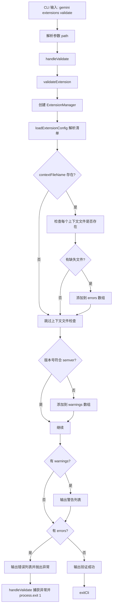

# validate.ts

> 提供验证本地扩展合法性的 CLI 子命令，检查清单文件、上下文文件存在性和版本号格式。

## 概述

`validate.ts` 实现了 `gemini extensions validate` 命令，用于对本地路径上的扩展进行合法性验证。检查内容包括：

1. 通过 `ExtensionManager.loadExtensionConfig()` 加载并解析 `gemini-extension.json` 清单文件。
2. 验证清单中引用的上下文文件（`contextFileName`）是否在磁盘上存在。
3. 验证版本号是否符合 semver 规范。

验证结果分为 **错误**（导致失败）和 **警告**（不阻断）两个级别。

## 架构图（mermaid）

## 主要导出

| 导出名 | 类型 | 说明 |
|--------|------|------|
| `handleValidate` | `(args: ValidateArgs) => Promise<void>` | 验证扩展的核心处理函数 |
| `validateCommand` | `CommandModule` | yargs 命令模块，定义 `validate <path>` 子命令 |

## 核心逻辑

1. **清单加载**：将输入路径解析为绝对路径后，通过 `extensionManager.loadExtensionConfig()` 加载 `gemini-extension.json`。
2. **上下文文件验证**：
   - 支持 `contextFileName` 为字符串或字符串数组。
   - 对每个上下文文件路径使用 `path.resolve()` 转为绝对路径后通过 `fs.existsSync()` 检查存在性。
   - 缺失的文件收集到 `errors` 数组中。
3. **版本号验证**：使用 `semver.valid()` 检查版本号格式，不合规的添加到 `warnings` 数组。
4. **结果输出**：先输出所有警告，再输出所有错误。存在错误时抛出异常导致非零退出码。

## 内部依赖

| 模块路径 | 导入项 | 用途 |
|----------|--------|------|
| `../../config/extension.js` | `ExtensionConfig` (type) | 扩展配置类型 |
| `../../config/extension-manager.js` | `ExtensionManager` | 扩展管理器，用于加载扩展配置 |
| `../../config/extensions/consent.js` | `requestConsentNonInteractive` | 非交互式授权请求回调 |
| `../../config/extensions/extensionSettings.js` | `promptForSetting` | 设置项输入提示回调 |
| `../../config/settings.js` | `loadSettings` | 加载项目设置 |
| `../utils.js` | `exitCli` | CLI 退出并执行清理 |

## 外部依赖

| 包名 | 导入项 | 用途 |
|------|--------|------|
| `yargs` | `CommandModule` (type) | 命令模块类型定义 |
| `node:fs` | `fs` | 文件系统操作（`existsSync`） |
| `node:path` | `path` | 路径解析 |
| `semver` | `semver` | 语义化版本号验证 |
| `@google/gemini-cli-core` | `debugLogger`, `getErrorMessage` | 调试日志和错误信息提取 |
