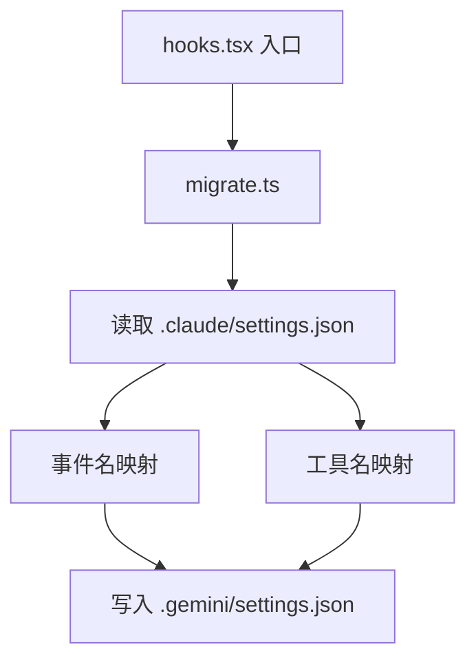

# commands/hooks 架构

> 实现 `gemini hooks` 子命令，目前提供从 Claude Code 迁移钩子配置的功能。

## 概述

`commands/hooks/` 目录包含 `gemini hooks <command>` 命令族的实现。当前仅包含 `migrate` 子命令，用于将 Claude Code 的钩子配置自动迁移为 Gemini CLI 格式。该迁移工具会读取 `.claude/settings.json` 中的钩子定义，转换事件名和工具名映射，然后写入 `.gemini/settings.json`。

## 架构图



## 目录结构

```
hooks/
└── migrate.ts    # hooks migrate 命令实现
```

## 关键文件

| 文件 | 功能 |
|------|------|
| `migrate.ts` | 实现 Claude Code 到 Gemini CLI 的钩子迁移。包含事件映射（PreToolUse->BeforeTool、PostToolUse->AfterTool 等）、工具名映射（Edit->replace、Bash->run_shell_command 等）、命令中环境变量替换（$CLAUDE_PROJECT_DIR->$GEMINI_PROJECT_DIR）。支持读取 `.claude/settings.local.json` 或 `.claude/settings.json`，合并到现有 Gemini 设置中 |

## 内部依赖

- `../../config/settings.ts` - `loadSettings()`、`SettingScope` 用于读写 Gemini 设置
- `../utils.ts` - `exitCli()` 退出函数

## 外部依赖

| 依赖 | 用途 |
|------|------|
| `yargs` | CommandModule 类型 |
| `strip-json-comments` | 解析带注释的 JSON 文件 |
| `@google/gemini-cli-core` | debugLogger、getErrorMessage |
| `node:fs`、`node:path` | 文件系统操作 |
