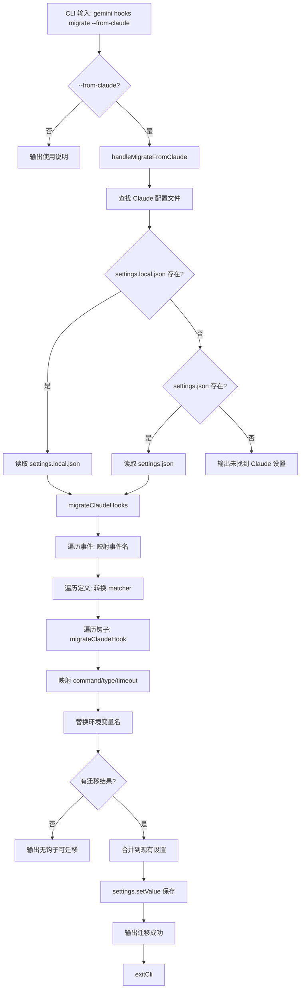

# migrate.ts

> 提供将 Claude Code 钩子配置迁移为 Gemini CLI 格式的 CLI 子命令。

## 概述

`migrate.ts` 实现了 `gemini hooks migrate` 命令，目前仅支持 `--from-claude` 模式。该命令读取 Claude Code 的 `.claude/settings.json` 或 `.claude/settings.local.json` 配置文件，将其中的钩子（hooks）配置自动转换为 Gemini CLI 格式，并写入 `.gemini/settings.json`。

迁移过程涉及三个维度的映射：
1. **事件名称映射**：如 `PreToolUse` -> `BeforeTool`
2. **工具名称映射**：如 `Edit` -> `replace`、`Bash` -> `run_shell_command`
3. **环境变量映射**：如 `$CLAUDE_PROJECT_DIR` -> `$GEMINI_PROJECT_DIR`

## 架构图（mermaid）

## 主要导出

| 导出名 | 类型 | 说明 |
|--------|------|------|
| `handleMigrateFromClaude` | `() => Promise<void>` | 从 Claude Code 迁移钩子的核心处理函数 |
| `migrateCommand` | `CommandModule` | yargs 命令模块，定义 `migrate` 子命令 |

## 核心逻辑

1. **Claude 配置发现**：优先读取 `.claude/settings.local.json`，其次 `.claude/settings.json`。使用 `strip-json-comments` 处理注释。
2. **事件名称映射** (`EVENT_MAPPING`)：
   - `PreToolUse` -> `BeforeTool`
   - `PostToolUse` -> `AfterTool`
   - `UserPromptSubmit` -> `BeforeAgent`
   - `Stop` / `SubAgentStop` -> `AfterAgent`
   - `SessionStart` / `SessionEnd` -> 保持不变
   - `PreCompact` -> `PreCompress`
   - `Notification` -> 保持不变
3. **工具名称映射** (`TOOL_NAME_MAPPING`)：
   - `Edit` -> `replace`、`Bash` -> `run_shell_command`、`Read` -> `read_file`
   - `Write` -> `write_file`、`Glob` -> `glob`、`Grep` -> `grep`、`LS` -> `ls`
4. **Matcher 转换** (`transformMatcher`)：使用正则表达式的 `\b` 词边界匹配替换 matcher 字符串中的工具名。
5. **钩子迁移** (`migrateClaudeHook`)：映射 `command`、`type`、`timeout` 字段，替换命令中的 `$CLAUDE_PROJECT_DIR` 为 `$GEMINI_PROJECT_DIR`。
6. **设置合并**：将迁移结果与现有 Gemini 钩子设置合并，后者优先被覆盖。通过 `settings.setValue(SettingScope.Workspace, 'hooks', mergedHooks)` 保存。

## 内部依赖

| 模块路径 | 导入项 | 用途 |
|----------|--------|------|
| `../../config/settings.js` | `loadSettings`, `SettingScope` | 加载和保存设置 |
| `../utils.js` | `exitCli` | CLI 退出并执行清理 |

## 外部依赖

| 包名 | 导入项 | 用途 |
|------|--------|------|
| `yargs` | `CommandModule` (type) | 命令模块类型定义 |
| `node:fs` | `fs` | 文件系统操作 |
| `node:path` | `path` | 路径处理 |
| `strip-json-comments` | `stripJsonComments` | 剥离 JSON 文件中的注释 |
| `@google/gemini-cli-core` | `debugLogger`, `getErrorMessage` | 调试日志和错误信息提取 |
