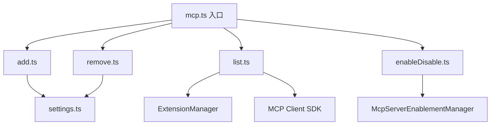

# commands/mcp 架构

> 实现 `gemini mcp` 子命令集，提供 MCP 服务器的添加、移除、列表和启用/禁用管理。

## 概述

`commands/mcp/` 目录包含 `gemini mcp <command>` 命令族的所有实现。MCP（Model Context Protocol）是一种让 AI 模型连接外部工具和数据源的标准协议。此命令族允许用户管理 MCP 服务器的配置，支持 stdio、SSE 和 HTTP 三种传输类型，配置存储在 user 或 project 级别的 settings.json 中。

## 架构图



## 目录结构

```
mcp/
├── add.ts            # 添加 MCP 服务器
├── remove.ts         # 移除 MCP 服务器
├── list.ts           # 列出所有 MCP 服务器及状态
└── enableDisable.ts  # 启用/禁用 MCP 服务器
```

## 关键文件

| 文件 | 功能 |
|------|------|
| `add.ts` | `addMcpServer()` 添加服务器到配置：支持 stdio（command + args + env）、SSE（url + headers）和 HTTP（url + headers）三种传输；支持 --timeout、--trust、--description、--include-tools、--exclude-tools 参数 |
| `remove.ts` | `removeMcpServer()` 从指定作用域（user/project）的配置中删除服务器 |
| `list.ts` | `listMcpServers()` 列出所有配置的 MCP 服务器，包括来自扩展的服务器；对每个服务器执行实际连接测试并显示状态（Connected/Disconnected/Blocked/Disabled）；`getMcpServersFromConfig()` 合并扩展和设置中的 MCP 服务器列表 |
| `enableDisable.ts` | `handleEnable()`/`handleDisable()` 启用/禁用指定的 MCP 服务器，支持 `--session` 仅影响当前会话；检查管理员策略和 allowlist/excludelist 限制 |

## 内部依赖

- `../../config/settings.ts` - 设置的加载和保存
- `../../config/mcp/mcpServerEnablement.ts` - MCP 服务器启用状态管理
- `../../config/extension-manager.ts` - 加载扩展提供的 MCP 服务器
- `../../config/extensions/consent.ts` - 非交互式同意处理
- `../utils.ts` - `exitCli()` 退出函数

## 外部依赖

| 依赖 | 用途 |
|------|------|
| `yargs` | CommandModule 类型和参数定义 |
| `@modelcontextprotocol/sdk` | MCP Client，用于连接测试 |
| `@google/gemini-cli-core` | MCPServerConfig、MCPServerStatus、createTransport、applyAdminAllowlist 等 |
| `chalk` | 终端颜色输出 |
