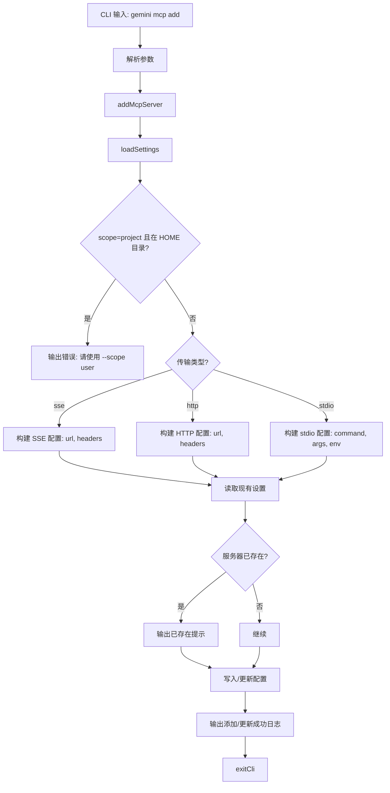

# add.ts

> 提供添加 MCP 服务器配置的 CLI 子命令，支持 stdio、SSE 和 HTTP 三种传输协议。

## 概述

`add.ts` 实现了 `gemini mcp add` 命令，用于向用户级或项目级配置中添加新的 MCP (Model Context Protocol) 服务器。支持三种传输类型：

- **stdio**（默认）：通过命令行进程通信，需要 `command` 和可选的 `args`、`env`。
- **sse**：通过 Server-Sent Events URL 通信，需要 URL 和可选的 `headers`。
- **http**：通过 HTTP URL 通信，需要 URL 和可选的 `headers`。

如果目标名称已存在，则执行更新操作。

## 架构图（mermaid）

## 主要导出

| 导出名 | 类型 | 说明 |
|--------|------|------|
| `addCommand` | `CommandModule` | yargs 命令模块，定义 `add <name> <commandOrUrl> [args...]` 子命令 |

## 核心逻辑

1. **参数解析**：
   - `name`：服务器名称（必填）
   - `commandOrUrl`：命令路径（stdio）或 URL（sse/http）（必填）
   - `args...`：额外参数（可选，支持 `--` 分隔符传递）
   - 选项：`--scope`（user/project）、`--transport`（stdio/sse/http）、`--env`、`--header`、`--timeout`、`--trust`、`--description`、`--include-tools`、`--exclude-tools`

2. **HOME 目录保护**：当 workspace 路径等于 user 路径时（即在 HOME 目录），禁止使用 `project` 作用域。

3. **Headers 解析**：将 `key:value` 格式的 header 字符串数组解析为 `Record<string, string>` 对象。

4. **配置构建**：根据传输类型构建不同结构的 `MCPServerConfig` 对象：
   - stdio：包含 `command`、`args`、`env`
   - sse/http：包含 `url`、`type`、`headers`
   - 通用字段：`timeout`、`trust`、`description`、`includeTools`、`excludeTools`

5. **配置保存**：通过 `settings.setValue(settingsScope, 'mcpServers', mcpServers)` 写入对应作用域的设置文件。

## 内部依赖

| 模块路径 | 导入项 | 用途 |
|----------|--------|------|
| `../../config/settings.js` | `loadSettings`, `SettingScope` | 加载和保存设置 |
| `../utils.js` | `exitCli` | CLI 退出并执行清理 |

## 外部依赖

| 包名 | 导入项 | 用途 |
|------|--------|------|
| `yargs` | `CommandModule` (type) | 命令模块类型定义 |
| `@google/gemini-cli-core` | `debugLogger`, `MCPServerConfig` (type) | 调试日志和 MCP 服务器配置类型 |
