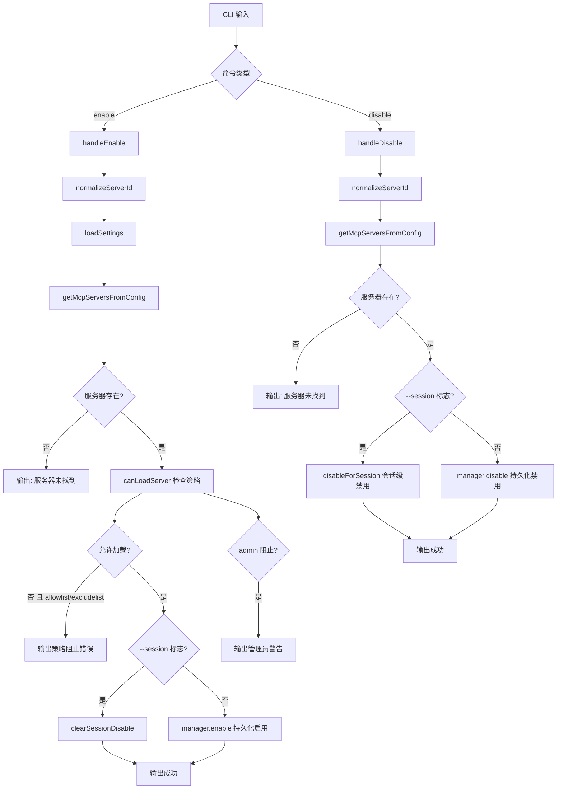

# enableDisable.ts

> 提供启用和禁用 MCP 服务器的 CLI 子命令，支持持久化和会话级操作。

## 概述

`enableDisable.ts` 在一个文件中实现了 `gemini mcp enable` 和 `gemini mcp disable` 两个命令。通过 `McpServerEnablementManager` 管理 MCP 服务器的启用/禁用状态。

- **启用**：可以持久化启用或清除会话级禁用（`--session` 标志）。启用前会检查管理员策略、允许列表和排除列表的约束。
- **禁用**：可以持久化禁用或仅在当前会话中禁用（`--session` 标志）。

## 架构图（mermaid）

## 主要导出

| 导出名 | 类型 | 说明 |
|--------|------|------|
| `enableCommand` | `CommandModule<object, Args>` | yargs 命令模块，定义 `enable <name>` 子命令 |
| `disableCommand` | `CommandModule<object, Args>` | yargs 命令模块，定义 `disable <name>` 子命令 |

## 核心逻辑

1. **服务器 ID 规范化**：通过 `normalizeServerId()` 统一服务器名称格式。
2. **服务器存在性检查**：调用 `getMcpServersFromConfig()` 获取所有配置的服务器（包括扩展提供的），对名称规范化后进行匹配。
3. **启用流程**：
   - 通过 `canLoadServer()` 检查管理员策略（`admin.mcp.enabled`）、允许列表（`mcp.allowed`）和排除列表（`mcp.excluded`）。
   - 如果被 allowlist 或 excludelist 阻止，输出错误并返回。
   - `--session` 模式：调用 `clearSessionDisable()` 清除会话级禁用。
   - 默认模式：调用 `manager.enable()` 持久化启用。
   - 如果被 admin 策略阻止，额外输出警告信息。
4. **禁用流程**：
   - `--session` 模式：调用 `disableForSession()` 仅在当前会话禁用。
   - 默认模式：调用 `manager.disable()` 持久化禁用。
5. **终端颜色**：使用 ANSI 转义码直接输出彩色文本（绿色/黄色/红色）。

## 内部依赖

| 模块路径 | 导入项 | 用途 |
|----------|--------|------|
| `../../config/mcp/mcpServerEnablement.js` | `McpServerEnablementManager`, `canLoadServer`, `normalizeServerId` | MCP 服务器启用状态管理和策略检查 |
| `../../config/settings.js` | `loadSettings` | 加载项目设置 |
| `./list.js` | `getMcpServersFromConfig` | 获取所有配置的 MCP 服务器 |
| `../utils.js` | `exitCli` | CLI 退出并执行清理 |

## 外部依赖

| 包名 | 导入项 | 用途 |
|------|--------|------|
| `yargs` | `CommandModule` (type) | 命令模块类型定义 |
| `@google/gemini-cli-core` | `debugLogger` | 调试日志 |
