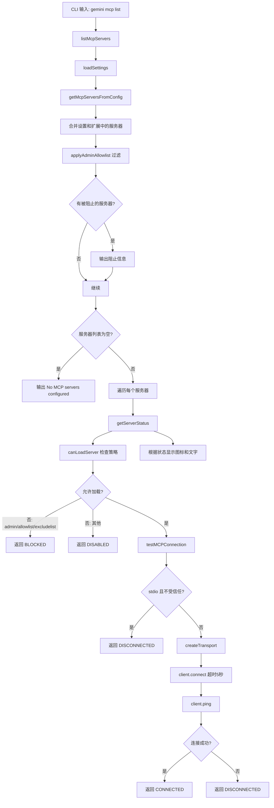

# list.ts

> 提供列出所有已配置 MCP 服务器并实时测试连接状态的 CLI 子命令。

## 概述

`list.ts` 实现了 `gemini mcp list` 命令，用于展示当前配置中所有 MCP 服务器的详细信息和连接状态。功能包括：

- 从设置和扩展中合并收集所有 MCP 服务器配置
- 应用管理员允许列表过滤
- 检查每个服务器的启用/禁用/阻止状态
- 对可用服务器执行实际的 MCP 协议连接测试（包含 ping）
- 以彩色图标和文字显示各服务器状态

## 架构图（mermaid）

## 主要导出

| 导出名 | 类型 | 说明 |
|--------|------|------|
| `getMcpServersFromConfig` | `(settings?) => Promise<{ mcpServers, blockedServerNames }>` | 从配置和扩展中收集所有 MCP 服务器 |
| `listMcpServers` | `(loadedSettingsArg?) => Promise<void>` | 列出并测试所有 MCP 服务器 |
| `listCommand` | `CommandModule<object, ListArgs>` | yargs 命令模块，定义 `list` 子命令 |

## 核心逻辑

1. **服务器收集** (`getMcpServersFromConfig`)：
   - 加载合并后的设置中的 `mcpServers`。
   - 通过 `ExtensionManager` 加载所有扩展，提取扩展中声明的 MCP 服务器。
   - 扩展服务器不会覆盖设置中同名的服务器（设置优先）。
   - 应用 `applyAdminAllowlist()` 过滤管理员限制的服务器。

2. **状态检查** (`getServerStatus`)：
   - 首先通过 `canLoadServer()` 检查策略约束（管理员开关、允许列表、排除列表、启用状态）。
   - 被策略阻止的返回 `BLOCKED`，被用户禁用的返回 `DISABLED`。
   - 通过策略检查的进入连接测试。

3. **连接测试** (`testMCPConnection`)：
   - **安全限制**：stdio 类型的服务器在不受信任的工作区中不执行连接测试。
   - 使用 `@modelcontextprotocol/sdk` 的 `Client` 创建测试客户端。
   - 通过 `createTransport()` 创建传输层。
   - 以 5 秒超时执行 `client.connect()` 和 `client.ping()`。
   - 成功返回 `CONNECTED`，失败返回 `DISCONNECTED`。

4. **状态显示**：使用 chalk 彩色图标：`CONNECTED`(绿勾)、`CONNECTING`(黄点)、`BLOCKED`(红禁)、`DISABLED`(灰圈)、`DISCONNECTED`(红叉)。

## 内部依赖

| 模块路径 | 导入项 | 用途 |
|----------|--------|------|
| `../../config/settings.js` | `loadSettings`, `MergedSettings`, `LoadedSettings` | 加载和使用设置 |
| `../../config/extension-manager.js` | `ExtensionManager` | 扩展管理器，获取扩展的 MCP 服务器 |
| `../../config/mcp/index.js` | `canLoadServer`, `McpServerEnablementManager` | MCP 服务器启用状态管理 |
| `../../config/extensions/consent.js` | `requestConsentNonInteractive` | 非交互式授权请求回调 |
| `../../config/extensions/extensionSettings.js` | `promptForSetting` | 设置项输入提示回调 |
| `../utils.js` | `exitCli` | CLI 退出并执行清理 |

## 外部依赖

| 包名 | 导入项 | 用途 |
|------|--------|------|
| `yargs` | `CommandModule` (type) | 命令模块类型定义 |
| `@google/gemini-cli-core` | `MCPServerStatus`, `createTransport`, `debugLogger`, `applyAdminAllowlist`, `getAdminBlockedMcpServersMessage`, `MCPServerConfig` | MCP 状态枚举、传输层创建、管理员策略应用 |
| `@modelcontextprotocol/sdk` | `Client` | MCP 协议客户端，用于连接测试 |
| `chalk` | `chalk` | 终端彩色输出 |
