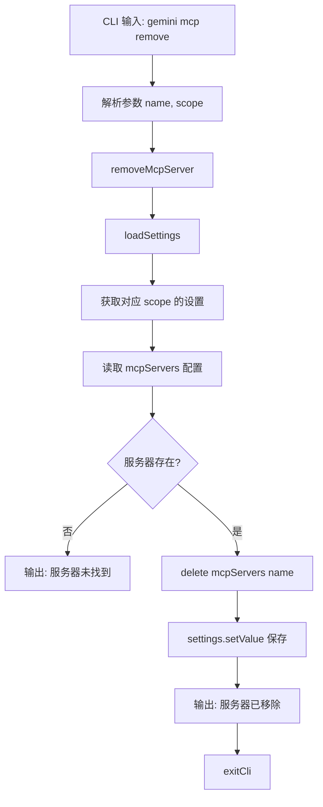

# remove.ts

> 提供从配置中移除 MCP 服务器的 CLI 子命令，支持用户级和项目级作用域。

## 概述

`remove.ts` 实现了 `gemini mcp remove` 命令，用于从指定作用域的配置中移除一个 MCP 服务器。操作简单直接：在对应作用域的 `mcpServers` 配置中删除指定名称的条目并保存。

## 架构图（mermaid）

## 主要导出

| 导出名 | 类型 | 说明 |
|--------|------|------|
| `removeCommand` | `CommandModule` | yargs 命令模块，定义 `remove <name>` 子命令 |

## 核心逻辑

1. **作用域确定**：根据 `--scope` 参数（默认 `project`）选择 `SettingScope.User` 或 `SettingScope.Workspace`。
2. **服务器查找**：从对应作用域的设置中读取 `mcpServers` 对象，检查目标名称是否存在。
3. **删除操作**：使用 `delete` 操作符从 `mcpServers` 对象中移除目标条目。
4. **持久化保存**：通过 `settings.setValue(settingsScope, 'mcpServers', mcpServers)` 将修改后的配置写回文件。

## 内部依赖

| 模块路径 | 导入项 | 用途 |
|----------|--------|------|
| `../../config/settings.js` | `loadSettings`, `SettingScope` | 加载和保存设置 |
| `../utils.js` | `exitCli` | CLI 退出并执行清理 |

## 外部依赖

| 包名 | 导入项 | 用途 |
|------|--------|------|
| `yargs` | `CommandModule` (type) | 命令模块类型定义 |
| `@google/gemini-cli-core` | `debugLogger` | 调试日志 |
