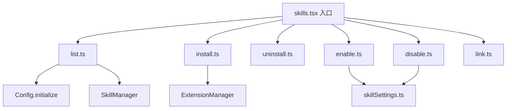

# commands/skills 架构

> 实现 `gemini skills` 子命令集，提供 Agent 技能的列表、安装、卸载、链接和启用/禁用管理。

## 概述

`commands/skills/` 目录包含 `gemini skills <command>` 命令族的所有实现。Agent 技能（Skills）是一种扩展机制，通过 SKILL.md 文件向 AI Agent 注入专业化的指令和领域知识。此命令族允许用户管理技能的安装和启用状态。

## 架构图



## 目录结构

```
skills/
├── list.ts       # 列出已发现的技能
├── install.ts    # 安装技能
├── uninstall.ts  # 卸载技能
├── enable.ts     # 启用技能
├── disable.ts    # 禁用技能
└── link.ts       # 链接本地技能
```

## 关键文件

| 文件 | 功能 |
|------|------|
| `list.ts` | `handleList()` 初始化配置以触发扩展加载和技能发现，从 `SkillManager` 获取技能列表并格式化输出；`--all` 参数显示内置技能 |
| `install.ts` | 安装技能扩展，通过 `ExtensionManager.installOrUpdateExtension()` 处理 |
| `uninstall.ts` | 卸载技能扩展 |
| `enable.ts` | 启用指定技能，更新技能设置文件 |
| `disable.ts` | 禁用指定技能，更新技能设置文件 |
| `link.ts` | 将本地目录链接为技能扩展（开发用途） |

## 内部依赖

- `../../config/config.ts` - `loadCliConfig()` 配置加载
- `../../config/settings.ts` - 设置管理
- `../../config/extension-manager.ts` - 扩展管理器
- `../../utils/skillSettings.ts` - 技能启用/禁用设置
- `../utils.ts` - `exitCli()` 退出函数

## 外部依赖

| 依赖 | 用途 |
|------|------|
| `yargs` | CommandModule 类型 |
| `chalk` | 终端颜色输出 |
| `@google/gemini-cli-core` | debugLogger、SkillManager |
