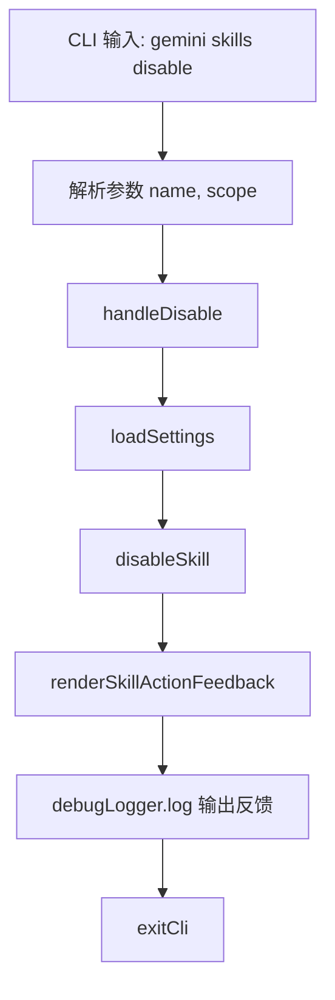

# disable.ts

> 提供禁用 Agent 技能的 CLI 子命令，支持用户级和工作区级作用域。

## 概述

`disable.ts` 实现了 `gemini skills disable` 命令，用于在指定作用域内禁用一个 Agent 技能。通过调用 `disableSkill` 工具函数执行实际禁用操作，然后使用 `renderSkillActionFeedback` 将结果渲染为格式化的反馈信息输出。

## 架构图（mermaid）

## 主要导出

| 导出名 | 类型 | 说明 |
|--------|------|------|
| `handleDisable` | `(args: DisableArgs) => Promise<void>` | 禁用技能的核心处理函数 |
| `disableCommand` | `CommandModule` | yargs 命令模块，定义 `disable <name> [--scope]` 子命令 |

## 核心逻辑

1. **参数解析**：接受必填的 `name` 和可选的 `--scope`（默认 `workspace`，可选 `user`）。
2. **设置加载**：使用当前工作目录加载设置。
3. **禁用执行**：调用 `disableSkill(settings, name, scope)` 执行禁用，返回操作结果。
4. **反馈渲染**：通过 `renderSkillActionFeedback` 将结果转换为用户可读的格式化字符串，使用 `chalk.bold` 高亮标签和 `chalk.dim` 显示路径。
5. **作用域映射**：在 handler 中将字符串 `'workspace'` / `'user'` 映射为 `SettingScope.Workspace` / `SettingScope.User` 枚举值。

## 内部依赖

| 模块路径 | 导入项 | 用途 |
|----------|--------|------|
| `../../config/settings.js` | `loadSettings`, `SettingScope` | 加载设置和作用域枚举 |
| `../../utils/skillSettings.js` | `disableSkill` | 技能禁用逻辑 |
| `../../utils/skillUtils.js` | `renderSkillActionFeedback` | 操作反馈渲染 |
| `../utils.js` | `exitCli` | CLI 退出并执行清理 |

## 外部依赖

| 包名 | 导入项 | 用途 |
|------|--------|------|
| `yargs` | `CommandModule` (type) | 命令模块类型定义 |
| `@google/gemini-cli-core` | `debugLogger` | 调试日志 |
| `chalk` | `chalk` | 终端彩色输出 |
