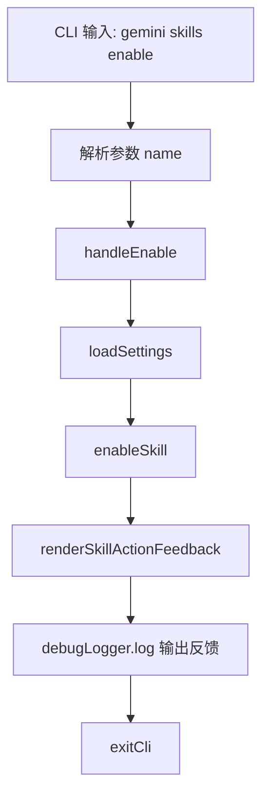

# enable.ts

> 提供启用 Agent 技能的 CLI 子命令。

## 概述

`enable.ts` 实现了 `gemini skills enable` 命令，用于启用一个已被禁用的 Agent 技能。与 `disable` 命令不同，`enable` 命令没有 `--scope` 参数，因为启用操作会移除所有禁用记录。通过调用 `enableSkill` 工具函数执行启用操作，并使用 `renderSkillActionFeedback` 渲染输出。

## 架构图（mermaid）

## 主要导出

| 导出名 | 类型 | 说明 |
|--------|------|------|
| `handleEnable` | `(args: EnableArgs) => Promise<void>` | 启用技能的核心处理函数 |
| `enableCommand` | `CommandModule` | yargs 命令模块，定义 `enable <name>` 子命令 |

## 核心逻辑

1. **参数解析**：接受必填的 `name` 参数（技能名称）。
2. **设置加载**：使用当前工作目录加载设置。
3. **启用执行**：调用 `enableSkill(settings, name)` 执行启用操作，返回操作结果。
4. **反馈渲染**：通过 `renderSkillActionFeedback` 将结果转换为格式化输出，使用 `chalk.bold` 和 `chalk.dim` 进行格式化。

## 内部依赖

| 模块路径 | 导入项 | 用途 |
|----------|--------|------|
| `../../config/settings.js` | `loadSettings` | 加载项目设置 |
| `../../utils/skillSettings.js` | `enableSkill` | 技能启用逻辑 |
| `../../utils/skillUtils.js` | `renderSkillActionFeedback` | 操作反馈渲染 |
| `../utils.js` | `exitCli` | CLI 退出并执行清理 |

## 外部依赖

| 包名 | 导入项 | 用途 |
|------|--------|------|
| `yargs` | `CommandModule` (type) | 命令模块类型定义 |
| `@google/gemini-cli-core` | `debugLogger` | 调试日志 |
| `chalk` | `chalk` | 终端彩色输出 |
