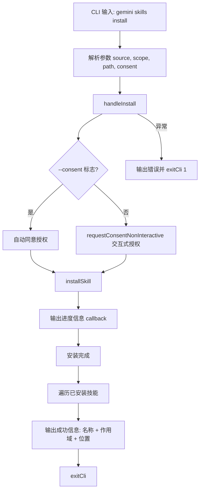

# install.ts

> 提供从 Git 仓库 URL 或本地路径安装 Agent 技能的 CLI 子命令，包含授权确认流程。

## 概述

`install.ts` 实现了 `gemini skills install` 命令，用于安装 Agent 技能。支持从 Git 仓库 URL 或本地路径安装，可选择安装到 `user`（全局）或 `workspace`（工作区）作用域。对于 Git 仓库源，还支持通过 `--path` 指定子路径。安装前会向用户展示授权确认信息。

## 架构图（mermaid）

## 主要导出

| 导出名 | 类型 | 说明 |
|--------|------|------|
| `handleInstall` | `(args: InstallArgs) => Promise<void>` | 安装技能的核心处理函数 |
| `installCommand` | `CommandModule` | yargs 命令模块，定义 `install <source> [--scope] [--path]` 子命令 |

## 核心逻辑

1. **参数解析**：
   - `source`：Git 仓库 URL 或本地路径（必填）。
   - `--scope`：安装作用域，默认 `user`（全局）。
   - `--path`：仅用于 Git 仓库源，指定仓库内的子路径。
   - `--consent`：跳过安全确认提示。

2. **授权流程**：
   - 构建一个 `requestConsent` 回调函数，接收 `SkillDefinition[]` 和 `targetDir`。
   - `--consent` 模式：输出授权内容后直接返回 `true`。
   - 默认模式：通过 `requestConsentNonInteractive` 显示授权字符串并等待用户确认。
   - 授权字符串通过 `skillsConsentString()` 生成。

3. **安装执行**：调用 `installSkill(source, scope, subpath, progressCallback, requestConsent)`。进度回调通过 `debugLogger.log` 输出中间信息。

4. **结果输出**：遍历安装的技能列表，使用 `chalk.green` 和 `chalk.bold` 输出每个技能的名称、作用域和安装位置。

## 内部依赖

| 模块路径 | 导入项 | 用途 |
|----------|--------|------|
| `../../utils/skillUtils.js` | `installSkill` | 技能安装核心逻辑 |
| `../../config/extensions/consent.js` | `requestConsentNonInteractive`, `skillsConsentString` | 授权流程和授权信息生成 |
| `../utils.js` | `exitCli` | CLI 退出并执行清理 |

## 外部依赖

| 包名 | 导入项 | 用途 |
|------|--------|------|
| `yargs` | `CommandModule` (type) | 命令模块类型定义 |
| `@google/gemini-cli-core` | `debugLogger`, `SkillDefinition` (type), `getErrorMessage` | 调试日志、技能定义类型和错误信息提取 |
| `chalk` | `chalk` | 终端彩色输出 |
