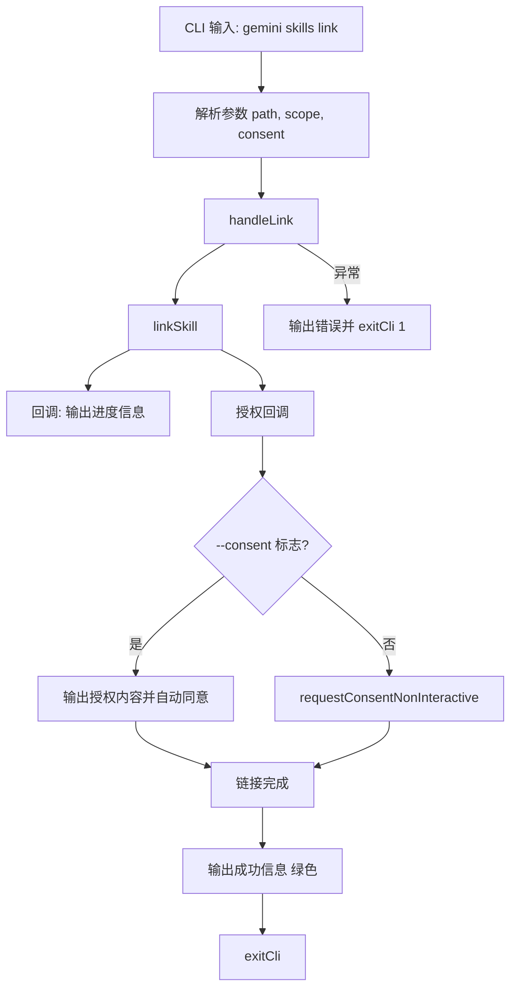

# link.ts

> 提供从本地路径链接 Agent 技能的 CLI 子命令，对源路径的修改会立即生效。

## 概述

`link.ts` 实现了 `gemini skills link` 命令，用于将本地路径上的 Agent 技能以"链接"方式安装。与 `install` 不同，链接模式不复制源文件，源路径的任何修改都会立即反映在已链接的技能中，适合技能开发调试场景。

## 架构图（mermaid）

## 主要导出

| 导出名 | 类型 | 说明 |
|--------|------|------|
| `handleLink` | `(args: LinkArgs) => Promise<void>` | 链接技能的核心处理函数 |
| `linkCommand` | `CommandModule` | yargs 命令模块，定义 `link <path>` 子命令 |

## 核心逻辑

1. **参数解析**：
   - `path`：本地技能路径（必填）。
   - `--scope`：安装作用域，默认 `user`（全局），可选 `workspace`。
   - `--consent`：跳过安全确认提示。

2. **链接执行**：调用 `linkSkill(path, scope, progressCallback, consentCallback)`。
   - 进度回调通过 `debugLogger.log` 输出信息。
   - 授权回调使用 `skillsConsentString()` 生成授权字符串（第四个参数为 `true` 表示链接模式）。

3. **授权流程**：与 `install` 类似，`--consent` 模式自动同意，默认模式通过交互式提示确认。

4. **成功输出**：使用 `chalk.green` 输出链接成功信息。

## 内部依赖

| 模块路径 | 导入项 | 用途 |
|----------|--------|------|
| `../../utils/skillUtils.js` | `linkSkill` | 技能链接核心逻辑 |
| `../../config/extensions/consent.js` | `requestConsentNonInteractive`, `skillsConsentString` | 授权流程和授权信息生成 |
| `../utils.js` | `exitCli` | CLI 退出并执行清理 |

## 外部依赖

| 包名 | 导入项 | 用途 |
|------|--------|------|
| `yargs` | `CommandModule` (type) | 命令模块类型定义 |
| `@google/gemini-cli-core` | `debugLogger`, `getErrorMessage` | 调试日志和错误信息提取 |
| `chalk` | `chalk` | 终端彩色输出 |
