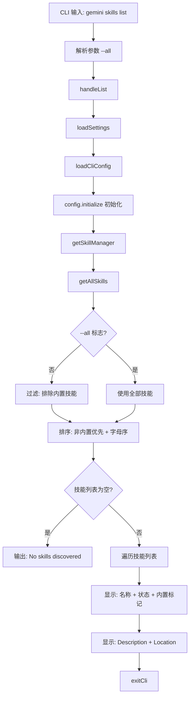

# list.ts

> 提供列出所有已发现 Agent 技能的 CLI 子命令，显示名称、状态、描述和位置信息。

## 概述

`list.ts` 实现了 `gemini skills list` 命令，用于展示当前环境中所有已发现的 Agent 技能。默认只显示非内置技能，使用 `--all` 标志可显示包括内置技能在内的全部技能。技能按类型（非内置优先）和名称字母顺序排序。

## 架构图（mermaid）

## 主要导出

| 导出名 | 类型 | 说明 |
|--------|------|------|
| `handleList` | `(args: { all?: boolean }) => Promise<void>` | 列出技能的核心处理函数 |
| `listCommand` | `CommandModule` | yargs 命令模块，定义 `list [--all]` 子命令 |

## 核心逻辑

1. **完整初始化**：与其他简单命令不同，此命令需要完整初始化 CLI 配置：
   - 调用 `loadCliConfig()` 创建完整的 CLI 配置对象。
   - 调用 `config.initialize()` 触发扩展加载和技能发现。
   - 通过 `config.getSkillManager()` 获取技能管理器。

2. **技能过滤和排序**：
   - 默认过滤掉 `isBuiltin === true` 的内置技能。
   - 排序规则：非内置技能排在前面，同类型按名称字母升序。

3. **状态显示**：
   - 启用状态：`[Enabled]`（绿色）或 `[Disabled]`（红色）。
   - 内置标记：`[Built-in]`（灰色），仅在 `--all` 模式下可见。
   - 每个技能显示名称、描述（Description）和位置（Location）。

## 内部依赖

| 模块路径 | 导入项 | 用途 |
|----------|--------|------|
| `../../config/settings.js` | `loadSettings` | 加载项目设置 |
| `../../config/config.js` | `loadCliConfig`, `CliArgs` (type) | 加载完整 CLI 配置 |
| `../utils.js` | `exitCli` | CLI 退出并执行清理 |

## 外部依赖

| 包名 | 导入项 | 用途 |
|------|--------|------|
| `yargs` | `CommandModule` (type) | 命令模块类型定义 |
| `@google/gemini-cli-core` | `debugLogger` | 调试日志 |
| `chalk` | `chalk` | 终端彩色输出 |
