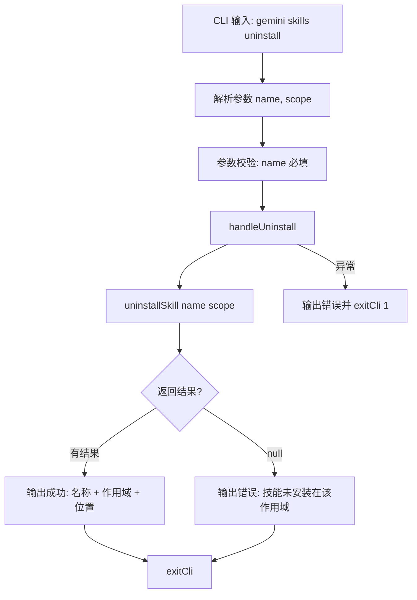

# uninstall.ts

> 提供按名称卸载已安装 Agent 技能的 CLI 子命令，支持用户级和工作区级作用域。

## 概述

`uninstall.ts` 实现了 `gemini skills uninstall` 命令，用于卸载指定名称的 Agent 技能。通过调用 `uninstallSkill` 工具函数执行实际卸载操作，支持从 `user`（全局）或 `workspace`（工作区）作用域中移除。

## 架构图（mermaid）

## 主要导出

| 导出名 | 类型 | 说明 |
|--------|------|------|
| `handleUninstall` | `(args: UninstallArgs) => Promise<void>` | 卸载技能的核心处理函数 |
| `uninstallCommand` | `CommandModule` | yargs 命令模块，定义 `uninstall <name> [--scope]` 子命令 |

## 核心逻辑

1. **参数解析**：
   - `name`：要卸载的技能名称（必填）。
   - `--scope`：卸载的作用域，默认 `user`（全局），可选 `workspace`。

2. **卸载执行**：调用 `uninstallSkill(name, scope)` 执行卸载。
   - 返回非 null 结果时表示成功，结果包含卸载位置信息（`location`）。
   - 返回 null 时表示该技能在指定作用域中未安装。

3. **结果输出**：
   - 成功：使用 `chalk.green` 和 `chalk.bold` 输出技能名称、作用域和位置。
   - 未找到：通过 `debugLogger.error` 输出错误信息。

## 内部依赖

| 模块路径 | 导入项 | 用途 |
|----------|--------|------|
| `../../utils/skillUtils.js` | `uninstallSkill` | 技能卸载核心逻辑 |
| `../utils.js` | `exitCli` | CLI 退出并执行清理 |

## 外部依赖

| 包名 | 导入项 | 用途 |
|------|--------|------|
| `yargs` | `CommandModule` (type) | 命令模块类型定义 |
| `@google/gemini-cli-core` | `debugLogger`, `getErrorMessage` | 调试日志和错误信息提取 |
| `chalk` | `chalk` | 终端彩色输出 |
