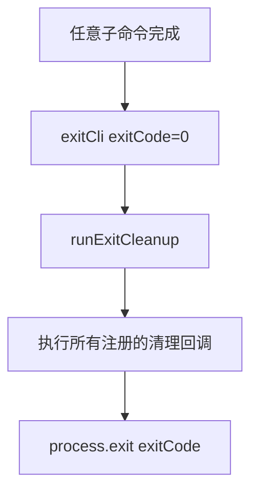

# utils.ts

> 提供 CLI 命令的通用退出函数，确保退出前执行清理操作。

## 概述

`utils.ts` 是 `commands` 目录下的通用工具模块，导出一个 `exitCli` 函数供所有子命令使用。该函数在调用 `process.exit()` 之前先执行注册的清理回调，确保资源（如临时文件、网络连接等）被正确释放。

## 架构图（mermaid）

## 主要导出

| 导出名 | 类型 | 说明 |
|--------|------|------|
| `exitCli` | `(exitCode?: number) => Promise<void>` | 执行清理后退出 CLI 进程，默认退出码为 0 |

## 核心逻辑

1. **清理执行**：调用 `runExitCleanup()` 执行通过 `../../utils/cleanup.js` 模块注册的所有退出清理回调。这是一个异步操作，等待所有清理任务完成。
2. **进程退出**：清理完成后调用 `process.exit(exitCode)` 终止进程。默认退出码为 0（成功），错误场景可传入 1 或其他非零值。

该函数被所有子命令的 handler 在执行完毕后调用，是 CLI 命令退出的统一出口。

## 内部依赖

| 模块路径 | 导入项 | 用途 |
|----------|--------|------|
| `../utils/cleanup.js` | `runExitCleanup` | 执行注册的退出清理回调 |

## 外部依赖

无外部依赖。
