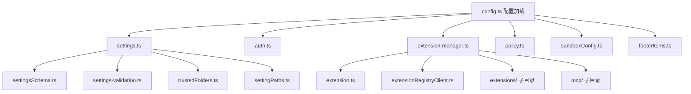

# config 架构

> CLI 的配置层，负责设置加载、合并、验证，以及扩展、MCP 服务器和策略引擎的配置管理。

## 概述

`config/` 目录是 Gemini CLI 的配置中枢，处理从用户设置到扩展管理的全部配置逻辑。它实现了一个多层级的设置系统（user、workspace、admin、session），支持环境变量解析、设置验证、深度合并等高级功能。该模块还管理扩展的加载和生命周期，以及策略引擎的配置。

## 架构图



## 目录结构

```
config/
├── config.ts                  # CLI 配置加载主模块（CliArgs 定义、parseArguments、loadCliConfig）
├── auth.ts                    # 认证方法验证
├── settings.ts                # 多层级设置系统（加载、合并、保存）
├── settingsSchema.ts          # 设置 Schema 定义和类型
├── settings-validation.ts     # 设置验证
├── settingPaths.ts            # 设置路径工具
├── extension-manager.ts       # 扩展管理器（安装、卸载、启用、禁用、加载）
├── extension.ts               # 扩展配置解析和类型
├── extensionRegistryClient.ts # 扩展注册表客户端
├── policy.ts                  # 策略引擎配置
├── sandboxConfig.ts           # 沙箱配置
├── trustedFolders.ts          # 文件夹信任管理
├── footerItems.ts             # 页脚项目配置
├── extensions/                # 扩展相关子模块
└── mcp/                       # MCP 服务器配置子模块
```

## 关键文件

| 文件 | 功能 |
|------|------|
| `config.ts` | 核心配置模块：定义 `CliArgs` 接口（所有 CLI 参数）、`parseArguments()` 通过 yargs 解析参数、`loadCliConfig()` 构建完整的 `Config` 对象（集成 MCP、扩展、策略、工具等） |
| `settings.ts` | 多层级设置系统：加载 user/workspace/admin 设置文件，执行深度合并，支持 env 变量解析，提供 `LoadedSettings` 接口用于读写设置 |
| `settingsSchema.ts` | 设置 Schema 定义，包含所有可配置项（general、ui、security、tools、hooks 等）的类型和默认值 |
| `auth.ts` | `validateAuthMethod()` 验证认证方式的环境变量配置（API Key、Vertex AI 凭据等） |
| `extension-manager.ts` | `ExtensionManager` 类：扩展生命周期管理（loadExtensions、installOrUpdateExtension、uninstallExtension、enableExtension、disableExtension、restartExtension） |
| `extension.ts` | `ExtensionConfig` 类型定义和解析，处理 `gemini-extension.json` 文件 |
| `extensionRegistryClient.ts` | 扩展注册表客户端，从远程 registry 查询和获取扩展信息 |
| `policy.ts` | 策略引擎配置，创建和更新策略引擎 |
| `sandboxConfig.ts` | 沙箱配置加载和构建 |
| `trustedFolders.ts` | 文件夹信任管理，决定是否允许加载工作区配置 |
| `footerItems.ts` | CLI 交互界面的页脚项目配置 |

## 内部依赖

- `extensions/` - 扩展存储、同意、启用管理、GitHub 操作、更新等
- `mcp/` - MCP 服务器启用管理
- `../utils/` - 环境变量解析、深度合并、JSON 注释处理等工具

## 外部依赖

| 依赖 | 用途 |
|------|------|
| `@google/gemini-cli-core` | Config 类、Storage、GEMINI_DIR、FatalConfigError 等核心类型 |
| `yargs` | 命令行参数解析 |
| `dotenv` | 环境变量加载 |
| `strip-json-comments` | 解析带注释的 JSON |
| `zod` | 设置验证 |
| `simple-git` | Git 操作（扩展安装） |
