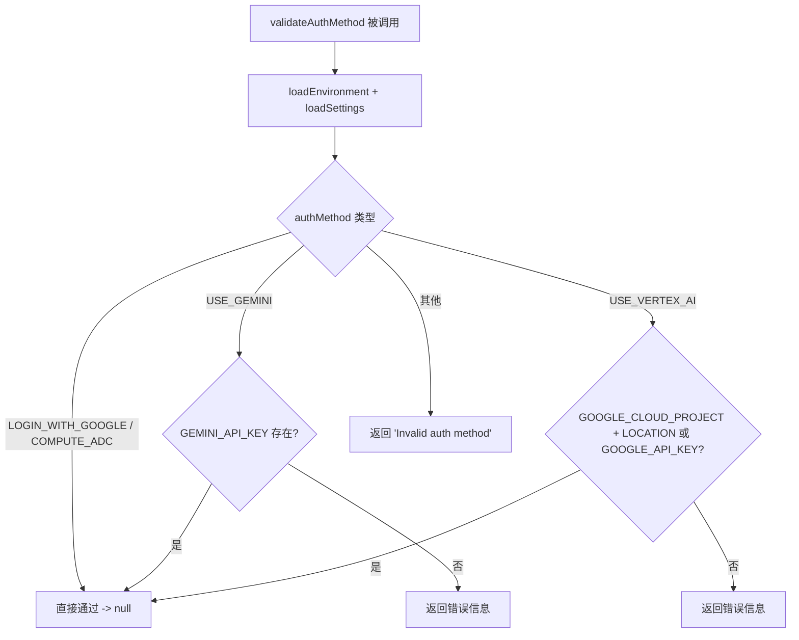

# auth.ts

> 验证用户选择的认证方式是否合法，并检查对应的环境变量是否已正确配置。

## 概述

`auth.ts` 是一个轻量级的认证验证模块，负责在 CLI 启动时校验用户指定的认证方法（`AuthType`）是否有效，并确认其所依赖的环境变量已经就绪。支持四种认证方式：Google 登录、Compute ADC、Gemini API Key 和 Vertex AI。验证通过返回 `null`，失败则返回描述性错误信息字符串。

## 架构图（mermaid）

## 主要导出

| 导出名称 | 类型 | 说明 |
|---------|------|------|
| `validateAuthMethod` | `(authMethod: string) => string \| null` | 校验认证方法，返回 `null` 表示通过，返回字符串表示错误信息 |

## 核心逻辑

1. **环境预加载**：调用 `loadEnvironment(loadSettings().merged, process.cwd())` 确保 `.env` 文件中的变量已加载到 `process.env`。
2. **Google 登录 / Compute ADC**：无需额外环境变量，直接通过。
3. **Gemini API**：要求 `GEMINI_API_KEY` 环境变量存在。
4. **Vertex AI**：要求 `GOOGLE_CLOUD_PROJECT` + `GOOGLE_CLOUD_LOCATION` 组合，或者 `GOOGLE_API_KEY`（快捷模式）。
5. **兜底**：其他任何值均视为非法认证方法。

## 内部依赖

| 模块 | 导入内容 | 用途 |
|------|---------|------|
| `./settings.js` | `loadEnvironment`, `loadSettings` | 加载用户/工作区设置并将 `.env` 注入到 `process.env` |

## 外部依赖

| 模块 | 导入内容 | 用途 |
|------|---------|------|
| `@google/gemini-cli-core` | `AuthType` | 认证类型枚举常量 |
