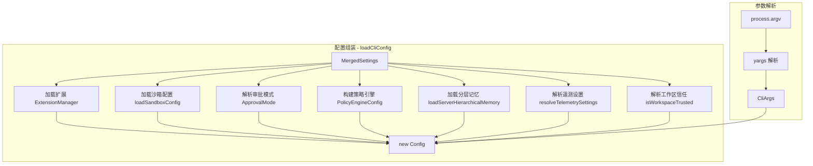

# config.ts

> CLI 的主配置组装模块，负责解析命令行参数并将所有设置、策略、扩展、沙箱等融合为最终的 `Config` 对象。

## 概述

`config.ts` 是 Gemini CLI 启动流程的核心枢纽。它完成两件关键工作：

1. **命令行参数解析**（`parseArguments`）：使用 `yargs` 定义并解析所有 CLI 选项（`--model`、`--sandbox`、`--yolo`、`--prompt` 等），注册子命令（MCP、extensions、skills、hooks），并进行互斥校验。
2. **配置对象组装**（`loadCliConfig`）：读取合并后的设置（`MergedSettings`），加载扩展、内存文件、沙箱配置、策略引擎、遥测设置等，最终构造出 `Config` 实例供整个 CLI 运行时使用。

整个文件约 879 行，涵盖了从命令行到运行时所需的完整配置链路。

## 架构图（mermaid）

## 主要导出

| 导出名称 | 类型 | 说明 |
|---------|------|------|
| `CliArgs` | `interface` | 命令行参数的类型定义，包含 query、model、sandbox、prompt、yolo、approvalMode 等所有 CLI 选项 |
| `parseArguments` | `(settings: MergedSettings) => Promise<CliArgs>` | 解析 `process.argv` 为结构化的 `CliArgs` 对象 |
| `isDebugMode` | `(argv: CliArgs) => boolean` | 判断是否处于调试模式（来自 `--debug` 标志或环境变量） |
| `LoadCliConfigOptions` | `interface` | `loadCliConfig` 的可选参数，支持自定义 `cwd` 和 `projectHooks` |
| `loadCliConfig` | `(settings, sessionId, argv, options?) => Promise<Config>` | 组装并返回完整的运行时 `Config` 对象 |

## 核心逻辑

### parseArguments

- 使用 `yargs` 定义 `$0` 默认命令和所有选项（model、prompt、sandbox、yolo、approval-mode、policy、extensions、resume 等）。
- 注册子命令：`mcp`、`extensions`（实验性）、`skills`、`hooks`。
- `.check()` 内置互斥校验：`--prompt` 与位置参数不可同时使用、`--yolo` 与 `--approval-mode` 互斥等。
- 逗号分隔参数通过 `coerceCommaSeparated` 统一展平为数组。
- 位置参数默认进入交互模式（TTY）；只有 `-p/--prompt` 才强制非交互（headless）模式。

### loadCliConfig

1. **扩展加载**：创建 `ExtensionManager` 并调用 `loadExtensions()`。
2. **记忆加载**：通过 `loadServerHierarchicalMemory` 加载 GEMINI.md 等上下文文件。
3. **审批模式**：按优先级解析 `argv > settings > default`，并受 `disableYoloMode`、`secureModeEnabled`、文件夹信任状态约束。
4. **策略引擎**：通过 `resolveWorkspacePolicyState` + `createPolicyEngineConfig` 生成策略配置。
5. **模型解析**：`argv.model > GEMINI_MODEL env > settings.model.name > PREVIEW_GEMINI_MODEL_AUTO`。
6. **MCP 服务器**：应用管理员白名单 `applyAdminAllowlist`，过滤被阻止的服务器。
7. **ACP 模式**：当 `--acp` 时探测 IDE 环境设置 `clientName`。
8. **最终输出**：构造 `new Config({...})` 包含约 90+ 个配置字段。

### mergeExcludeTools（内部函数）

将设置中的 `tools.exclude` 与额外排除（如非交互模式下的 `ask_user`）合并去重。

## 内部依赖

| 模块 | 导入内容 | 用途 |
|------|---------|------|
| `./settings.js` | `Settings`, `MergedSettings`, `saveModelChange`, `loadSettings` | 设置类型与加载/保存 |
| `./sandboxConfig.js` | `loadSandboxConfig` | 沙箱配置加载 |
| `./trustedFolders.js` | `isWorkspaceTrusted` | 工作区信任判定 |
| `./policy.js` | `createPolicyEngineConfig`, `resolveWorkspacePolicyState` | 策略引擎配置 |
| `./extension-manager.js` | `ExtensionManager` | 扩展管理器 |
| `./mcp/mcpServerEnablement.js` | `McpServerEnablementManager` | MCP 服务器启用管理 |
| `./extensions/consent.js` | `requestConsentNonInteractive` | 非交互模式下的扩展同意回调 |
| `./extensions/extensionSettings.js` | `promptForSetting` | 扩展设置交互式提示 |
| `../commands/mcp.js` | `mcpCommand` | MCP 子命令定义 |
| `../commands/extensions.js` | `extensionsCommand` | 扩展子命令定义 |
| `../commands/skills.js` | `skillsCommand` | 技能子命令定义 |
| `../commands/hooks.js` | `hooksCommand` | 钩子子命令定义 |
| `../utils/resolvePath.js` | `resolvePath` | 路径解析工具 |
| `../utils/sessionUtils.js` | `RESUME_LATEST` | 会话恢复标识常量 |
| `../utils/cleanup.js` | `runExitCleanup` | 退出清理 |

## 外部依赖

| 模块 | 导入内容 | 用途 |
|------|---------|------|
| `@google/gemini-cli-core` | `Config`, `ApprovalMode`, `FileDiscoveryService`, `debugLogger`, `coreEvents` 等 | 核心运行时类型与工具 |
| `yargs` / `yargs/helpers` | `yargs`, `hideBin` | 命令行参数解析框架 |
| `node:path` | `path` | 路径操作 |
| `node:process` | `process` | 进程环境与参数 |
| `node:stream` | `EventEmitter` | 事件发射器类型 |
